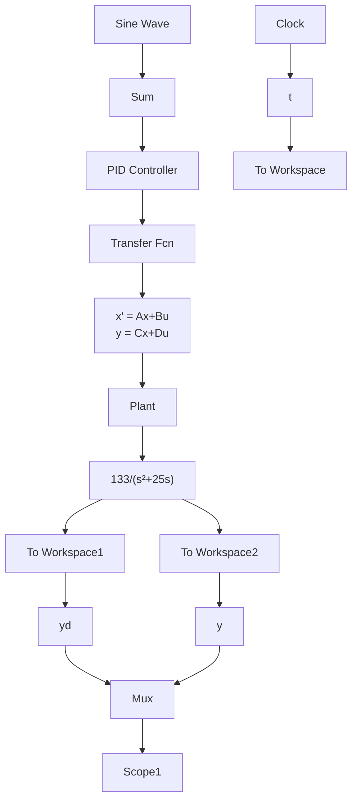

# 〖仿真程序〗

(1) Simulink 仿真程序: chap1\_2.mdl


<details>
<summary>flowchart</summary>


</details>

程序中同时采用了传递函数 $\frac{133}{s^2 + 25s}$ 的另一种表达方式，即状态方程的形式，其中 $A = \begin{bmatrix} 0 & 1 \\ 0 & -25 \end{bmatrix}, B = \begin{bmatrix} 0 \\ 133 \end{bmatrix}, C = \begin{bmatrix} 1 & 0 \end{bmatrix}, D = 0$ 。

(2) 作图程序: chap1\_2plot.m

```matlab
close all;
plot(t,yd(:,1),'r',t,y(:,1),'k:',linewidth',2);
xlabel('time(s)');ylabel('yd,y');
legend('Ideal position signal','Position tracking'); 
```
