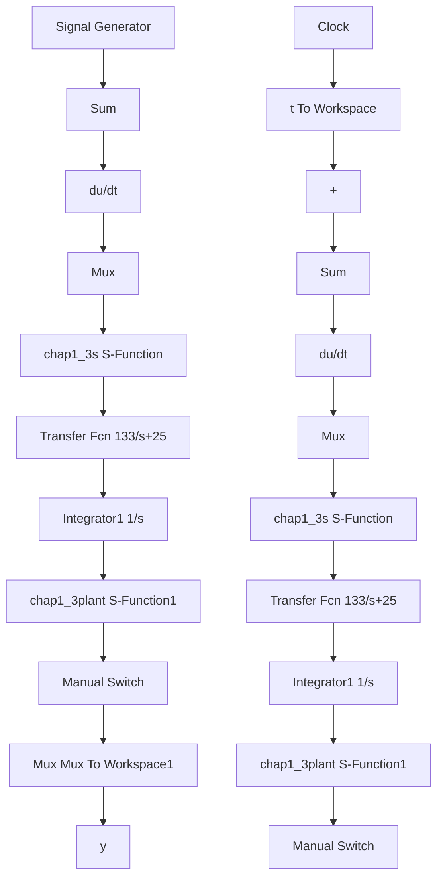

# 〖仿真程序〗

(1) Simulink 仿真主程序: chap1\_3.mdl


<details>
<summary>flowchart</summary>


</details>

(2) S 函数 PID 控制器程序: chap1\_3s.m

%S-function for continuous state equation function [sys,x0,str,ts]=s\_function(t,x,u,flag)

```matlab
switch flag,
%Initialization
    case 0,
    [sys,x0,str,ts]=mdlInitializeSizes;
%Outputs
    case 3,
    sys=mdlOutputs(t,x,u);
%Unhandled flags
    case {2,4,9}
    sys = [];
%Unexpected flags
    otherwise
    error(['Unhandled flag = ',num2str(flag)]);
end
%mdlInitializeSizes
function [sys,x0,str,ts]=mdlInitializeSizes
sizes = simsizes;
sizes.NumContStates = 0;
sizes.NumDiscStates = 0;
sizes.NumOutputs = 1;
sizes.NumInputs = 3;
sizes.DirFeedthrough = 1;
sizes.NumSampleTimes = 0;
sys=simsizes(sizes);
x0=[];
str=[];
ts=[];
function sys=mdlOutputs(t,x,u)
error=u(1);
derror=u(2);
errori=u(3);

kp=60;
ki=1;
kd=3;
ut=kp*error+kd*derror+ki*errori;
sys(1)=ut; 
```

(3) S 函数被控对象程序: chap1\_3plant.m  
```matlab
%S-function for continuous state equation
function [sys,x0,str,ts]=s_function(t,x,u,flag)
switch flag,
%Initialization
case 0,
[sys,x0,str,ts]=mdlInitializeSizes;
case 1,
sys=mdlDerivatives(t,x,u);
%Outputs 
```

```matlab
case 3,
sys=mdlOutputs(t,x,u);
%Unhandled flags
case {2,4,9}
sys = [];
%Unexpected flags
otherwise
error(['Unhandled flag = ',num2str(flag)]);
end

%mdlInitializeSizes
function [sys,x0,str,ts]=mdlInitializeSizes
sizes = simsizes;
sizes.NumContStates = 2;
sizes.NumDiscStates = 0;
sizes.NumOutputs = 1;
sizes.NumInputs = 1;
sizes.DirFeedthrough = 0;
sizes.NumSampleTimes = 0;

sys=simsizes(sizes);
x0=[0,0];
str=[];
ts=[];
function sys=mdlDerivatives(t,x,u)
sys(1)=x(2);
%sys(2)=-(25+5*sin(t))*x(2)+(133+10*sin(t))*u;
sys(2)=-(25+10*rands(1))*x(2)+(133+30*rands(1))*u;

function sys=mdlOutputs(t,x,u)
sys(1)=x(1); 
```

(4) 作图程序: chap1\_3plot.m

```matlab
close all;
plot(t,y(:,1),'r',t,y(:,2),'k:','linewidth',2);
xlabel('time(s)');ylabel('yd,y');
legend('Ideal position signal','Position tracking'); 
```
