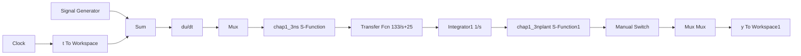

# 〖仿真程序〗

(1) Simulink 仿真主程序: chap1\_3n.mdl


<details>
<summary>flowchart</summary>


</details>

(2) 简化的 S 函数控制器程序: chap1\_3ns.m

```matlab
function [sys,x0]=s_function(t,x,u,flag)
kp=60;ki=1;kd=3;
if flag==0
    sys=[0,0,1,3,0,1]; %Outputs=1,Inputs=3,DirFeedthrough=0;
    x0=[];
elseif flag==3
    sys(1)=kp*u(1)+ki*u(2)+kd*u(3);
else
    sys=[];
end 
```

（3）简化 S 函数被控对象程序：chap1\_3nplant.m

```matlab
function [sys,x0]=s_function(t,x,u,flag)
if flag==0
    sys=[2,0,1,1,0,0]; %ContStates=2,Outputs=1,Inputs=1
    x0=[0,0];
elseif flag==1
    sys(1)=x(2);
    sys(2)=-(25+10*rands(1))*x(2)+(133+30*rands(1))*u;
elseif flag==3
    sys(1)=x(1);
else
    sys=[];
end 
```

(4) 作图程序: chap1\_3nplot.m

```matlab
close all;
plot(t,y(:,1),'r',t,y(:,2),'k:','linewidth',2);
xlabel('time(s)');ylabel('yd,y');
legend('Ideal position signal','Position tracking'); 
```


