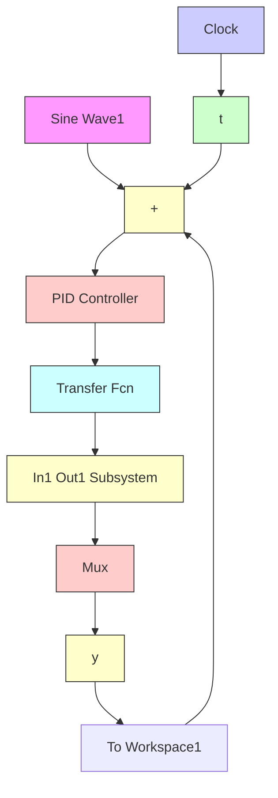
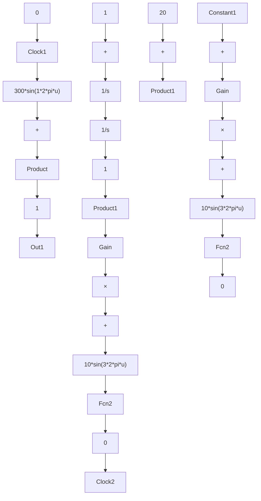

# 〖仿真程序〗

(1) Simulink 仿真主程序: chap1\_4.mdl


<details>
<summary>flowchart</summary>


</details>

其中被控对象封装模块如下:


<details>
<summary>flowchart</summary>


</details>

(2) 作图程序: chap1\_4plot.m

```txt
close all;
plot(t,y(:,1),'r',t,y(:,2),'k:',linewidth',2);
xlabel('time(s)');ylabel('yd,y');
legend('Ideal position signal','Position tracking'); 
```
