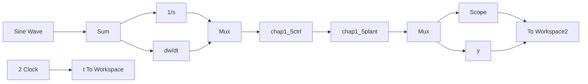

# 〖仿真程序〗

(1) Simulink 主程序: chap1\_5.mdl


<details>
<summary>flowchart</summary>


</details>

(2) S 函数控制器子程序: chap1\_5ctrl.m

```matlab
function [sys,x0,str,ts] = spacemodel(t,x,u,flag)
switch flag,
case 0,
[sys,x0,str,ts]=mdlInitializeSizes;
case 1,
sys=mdlDerivatives(t,x,u);
case 3,
sys=mdlOutputs(t,x,u); 
```

```matlab
case {2,4,9}
sys=[];
otherwise
    error(['Unhandled flag = ',num2str(flag)]);
end
function [sys,x0,str,ts]=mdlInitializeSizes
sizes = simsizes;
sizes.NumContStates = 0;
sizes.NumDiscStates = 0;
sizes.NumOutputs = 1;
sizes.NumInputs = 3;
sizes.DirFeedthrough = 1;
sizes.NumSampleTimes = 1; % At least one sample time is needed
sys = simsizes(sizes);
x0 = [];
str = [];
ts = [0 0];
function sys=mdlOutputs(t,x,u)
kp=10;
ki=2;
kd=1;
ut=kp*u(1)+ki*u(2)+kd*u(3);
sys(1)=ut; 
```

(3) S 函数被控对象子程序: chap1\_5plant.m  
```matlab
function [sys,x0,str,ts] = spacemodel(t,x,u,flag)
switch flag,
case 0,
    [sys,x0,str,ts]=mdlInitializeSizes;
case 1,
    sys=mdlDerivatives(t,x,u);
case 3,
    sys=mdlOutputs(t,x,u);
case {2,4,9}
    sys=[];
otherwise
    error(['Unhandled flag = ',num2str(flag)]);
end
function [sys,x0,str,ts]=mdlInitializeSizes
sizes = simsizes;
sizes.NumContStates = 2;
sizes.NumDiscStates = 0;
sizes.NumOutputs = 1;
sizes.NumInputs = 1;
sizes.DirFeedthrough = 0;
sizes.NumSampleTimes = 1; % At least one sample time is needed
sys = simsizes(sizes);
x0 = [0;0];
str = [];
ts = [0 0]; 
```

```matlab
function sys=mdlDerivatives(t,x,u) %Time-varying model
ut=u(1);
J=20+10*sin(6*pi*t);
K=400+300*sin(2*pi*t);
sys(1)=x(2);
sys(2)=-J*x(2)+K*ut;
function sys=mdlOutputs(t,x,u)
sys(1)=x(1); 
```

（4）作图程序：chap1\_5plot.m

```matlab
close all;
plot(t,y(:,1),'r',t,y(:,2),'k:','linewidth',2);
xlabel('time(s)');ylabel('yd,y');
legend('Ideal position signal','Position tracking');s 
```

通过本实例的仿真可见，采用 S 函数，很容易地表示复杂的被控对象及控制算法，特别适合于复杂控制系统的仿真。


