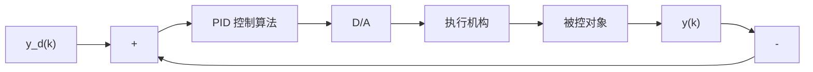
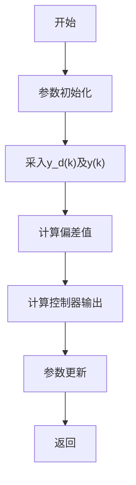

# 1.3.1 位置式 PID 控制算法

按模拟 PID 控制算法，以一系列的采样时刻点 kT 代表连续时间 t，以矩形法数值积分近似代替积分，以一阶后向差分近似代替微分，即

$$
\left\{ \begin{array}{l} t \approx k T \quad (k = 0, 1, 2, \dots) \\ \int_ {0} ^ {t} \operatorname{error} (t) \mathrm{d} t \approx T \sum_ {j = 0} ^ {k} \operatorname{error} (j T) = T \sum_ {j = 0} ^ {k} \operatorname{error} (j) \\ \frac {\operatorname{derror} (t)}{\mathrm{d} t} \approx \frac {\operatorname{error} (k T) - \operatorname{error} ((k - 1) T)}{T} = \frac {\operatorname{error} (k) - \operatorname{error} (k - 1)}{T} \end{array} \right. \tag {1.4}
$$

可得离散 PID 表达式

$$
\begin{array}{l} u (k) = k _ {\mathrm{p}} (\text { error } (k) + \frac {T}{T _ {\mathrm{I}}} \sum_ {j = 0} ^ {k} \text { error } (j) + \frac {T _ {\mathrm{D}}}{T} (\text { error } (k) - \text { error } (k - 1))) \\ = k _ {\mathrm{p}} \operatorname{error} (k) + k _ {\mathrm{i}} \sum_ {j = 0} ^ {k} \operatorname{error} (j) T + k _ {\mathrm{d}} \frac {\operatorname{error} (k) - \operatorname{error} (k - 1)}{T} \\ \end{array}
$$

式中， $k_{i}=\frac{k_{p}}{T_{I}}$ ; $k_{d}=k_{p}T_{D}$ ; T 为采样周期；k 为采样序号， $k=1,2,\cdots$ ; error(k-1) 和 error(k) 分别为第 $(k-1)$ 和第 k 时刻所得的偏差信号。

位置式 PID 控制系统如图 1-8 所示。

根据位置式 PID 控制算法得到其程序框图如图 1-9 所示。

flowchart

图 1-8 位置式 PID 控制系统

flowchart

图 1-9 位置式 PID 控制算法程序框图

在仿真过程中，可根据实际情况，对控制器的输出进行限幅： $[-10, +10]$ 。

