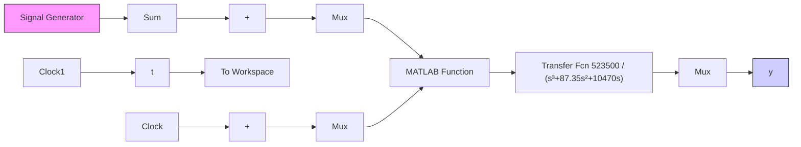

# 〖仿真程序〗

(1) Simulink 主程序: chap1\_7.mdl


<details>
<summary>flowchart</summary>


</details>

(2) 控制器子程序: chap1\_7ctrl.m

```matlab
function [u]=pidsimf(u1,u2)
persistent pidmat errori error_1
t=u1; 
```

```matlab
if t==0
    errori=0;
    error_1=0;
end

kp=2.5;
ki=0.020;
kd=0.50;

error=u2;
errord=error-error_1;
errori=errori+error;

u=kp*error+kd*errord+ki*errori;
error_1=error; 
```

(3) 作图程序: chap1\_7plot.m

```matlab
close all;
plot(t,y(:,1),'r',t,y(:,2),'k:','linewidth',2);
xlabel('time(s)');ylabel('yd,y');
legend('Ideal position signal','Position tracking'); 
```
