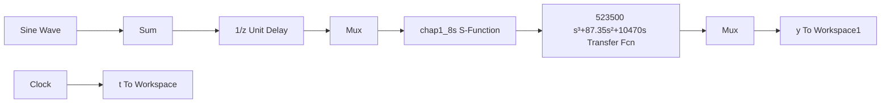

# 〖仿真程序〗

(1) Simulink 主程序: chap1\_8.mdl


<details>
<summary>flowchart</summary>


</details>

(2) PID 控制器程序: chap1\_8s.m

```matlab
function [sys,x0,str,ts]=exp_pidf(t,x,u,flag)
switch flag,
case 0    % initializations
    [sys,x0,str,ts]=mdlInitializeSizes;
case 2    % discrete states updates
    sys=mdlUpdates(x,u);
case 3    % computation of control signal
%    sys=mdlOutputs(t,x,u,kp,ki,kd,MTab);
    sys=mdlOutputs(t,x,u);
case {1,4,9}    % unused flag values
    sys=[];
otherwise    % error handling
    error(['Unhandled flag = ',num2str(flag)]);
end;

%
% when flag=0, perform system initialization
%
function [sys,x0,str,ts]=mdlInitializeSizes
sizes=simsizes;    % read default control variables
sizes.NumContStates=0; % no continuous states
sizes.NumDiscStates=3; % 3 states and assume they are the P/I/D components
sizes.NumOutputs=1;    % 2 output variables: control u(t) and state x(3)
sizes.NumInputs=2;    % 4 input signals
sizes.DirFeedthrough=1;% input reflected directly in output
sizes.NumSampleTimes=1;% single sampling period
sys=simsizes(sizes);    %
x0=[0;0;0];    % zero initial states
str=[];
ts=[-1 0];    % sampling period
%
% when flag=2, updates the discrete states
%
function sys=mdlUpdates(x,u)
T=0.001;
sys=[u(1); 
```

```matlab
x(2)+u(1)*T;
(u(1)-u(2))/T];
%
% when flag=3, computes the output signals
%
function sys = mdlOutputs(t,x,u,kp,ki,kd,MTab)
kp=1.5;
ki=2.0;
kd=0.05;
%sys=[kp,ki,kd]*x;
sys=kp*x(1)+ki*x(2)+kd*x(3); 
```

(3) 作图程序: chap1\_8plot.m

```txt
close all;
plot(t,y(:,1),'r',t,y(:,2),'k:',linewidth',2);
xlabel('time(s)');ylabel('yd,y');
legend('Ideal position signal','Position tracking'); 
```


