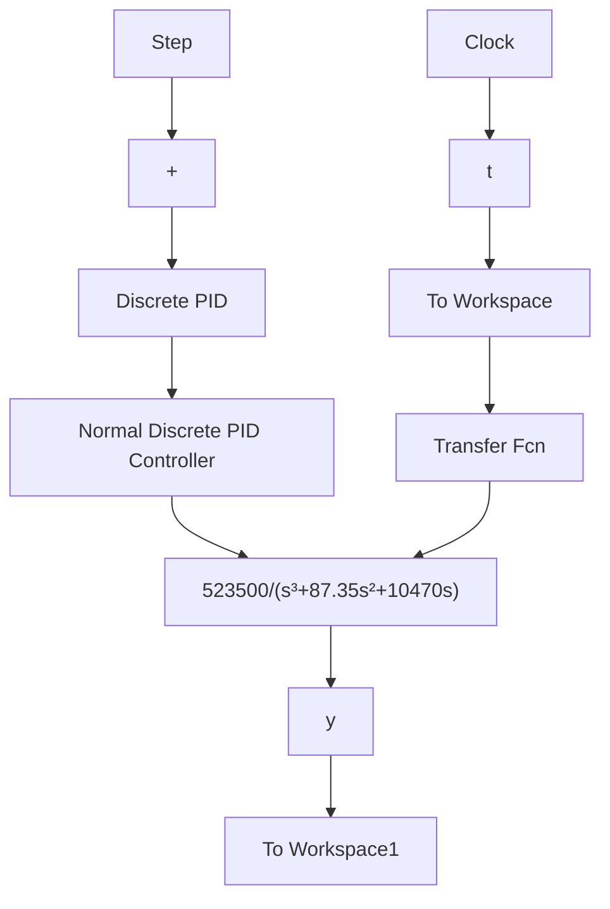
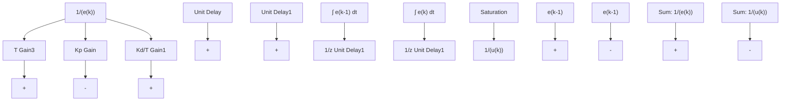

# (1) Simulink 主程序: chap1\_11.mdl

离散 PID 控制的比例、微分和积分三项分别由 Simulink 模块实现。

flowchart

```mermaid
graph TD
    A["Step"] --> B["+"]
    C["Clock"] --> D["t"]
    B --> E["Discrete PID"]
    D --> F["To Workspace"]
    E --> G["Normal Discrete PID Controller"]
    F --> H["Transfer Fcn"]
    G --> I["523500/(s³+87.35s²+10470s)"]
    H --> I
    I --> J["y"]
    J --> K["To Workspace1"]
```

离散 PID 控制器子程序如下:

flowchart

```mermaid
graph TD
    A["1/(e(k))"] --> B["T Gain3"]
    A --> C["Kp Gain"]
    A --> D["Kd/T Gain1"]
    B --> E["+"]
    C --> F["-"]
    D --> G["+"]
    H["Unit Delay"] --> I["+"]
    J["Unit Delay1"] --> K["+"]
    L["∫ e(k-1) dt"] --> M["1/z Unit Delay1"]
    N["∫ e(k) dt"] --> O["1/z Unit Delay1"]
    P["Saturation"] --> Q["1/(u(k))"]
    R["e(k-1)"] --> S["+"]
    T["e(k-1)"] --> U["-"]
    V["Sum: 1/(e(k))"] --> W["+"]
    X["Sum: 1/(u(k))"] --> Y["-"]
```

