# 〖仿真程序〗

(1) 初始化程序: chap1\_14int.m

```matlab
clear all;
close all;

ts=20;
sys=tf([1],[60,1],'inputdelay',80);
dsys=c2d(sys,ts,'zoh');
[num,den]=tfdata(dsys,'v');

kp=1.80;
```

```txt
ki=0.05;
kd=0.20; 
```

(2) Simulink 主程序: chap1\_14.mdl

```mermaid
graph TD
    A["Step1"] --> B((+))
    B --> C["z-1/z"]
    C --> D["Discrete Transfer Fcn"]
    D --> E["kd"]
    E --> F["+"]
    F --> G["num/den"]
    G --> H["Scope"]
    H --> I["Mux"]
    I --> J["y"]
    J --> K["To Workspace1"]
    K --> L["0"]
    L --> M["t"]
    M --> N["Clock"]
    N --> O["To Workspace"]
    O --> P["0"]
    P --> Q["abs(u)"]
    Q --> R["Fcn"]
    R --> S["Discrete-Time Integrator"]
    S --> T["KTs z/z-1"]
    T --> U["i"]
    U --> V["Switch"]
    V --> W["Scope"]
    W --> X["0"]
    X --> Y["abs(u)"]
    Y --> Z["Fcn"]
    Z --> AA["Discrete-Time Integrator"]
    AA --> AB["i"]
    AB --> AC["Switch"]
    AC --> AD["0"]
    AD --> AE["abs(u)"]
    AE --> AF["Fcn"]
    AF --> AG["i"]
    AG --> AH["Switch"]
    AH --> AI["0"]
    AI --> AJ["abs(u)"]
    AJ --> AK["Fcn"]
    AK --> AL["i"]
    AL --> AM["Switch"]
    AM --> AN["i"]
    AN --> AO["0"]
    AO --> AP["abs(u)"]
    AP --> AQ["Fcn"]
    AQ --> AR["i"]
    AR --> AS["Switch"]
    AS --> AT["i"]
    AT --> AU["abs(u)"]
    AU --> AV["Fcn"]
    AV --> AW["i"]
    AW --> AX["Switch"]
    AX --> AY["i"]
    AY --> AZ["abs(u)"]
    AZ --> BA["Fcn"]
    BA --> BB["i"]
    BB --> BC["Switch"]
    BC --> BD["i"]
    BD --> BE["abs(u)"]
    BE --> BF["Fcn"]
    BF --> BG["i"]
    BG --> BH["Switch"]
    BH --> BI["i"]
    BI --> BJ["abs(u)"]
    BJ --> BK["Fcn"]
    BK --> BL["i"]
    BL --> BM["Switch"]
    BM --> BN["i"]
    BN --> BO["abs(u)"]
    BO --> BP["Fcn"]
    BP --> BQ["i"]
    BQ --> BR["Switch"]
    BR --> BS["i"]
    BS --> BT["abs(u)"]
    BT --> BU["Fcn"]
    BU --> BV["i"]
    BV --> BW["Switch"]
    BW --> BX["i"]
    BX --> BY["abs(u)"]
    BY --> BZ["Fcn"]
    BZ --> CA["i"]
    CA --> CB["Switch"]
    CB --> CC["i"]
    CC --> CD["abs(u)"]
    CD --> CE["Fcn"]
    CE --> CF["i"]
    CF --> CG["Switch"]
    CG --> CH["i"]
    CH --> CI["abs(u)"]
    CI --> CJ["Fcn"]
    CJ --> CK["i"]
    CK --> CL["Switch"]
    CL --> CD
```


<details>
<summary>flowchart</summary>


</details>

(3) 作图程序: chap1\_14plot.m

```txt
close all;
plot(t,y(:,1),'r',t,y(:,2),'k:',linewidth',2);
xlabel('time(s)');ylabel('yd,y');
legend('Ideal position signal','Position tracking'); 
```


