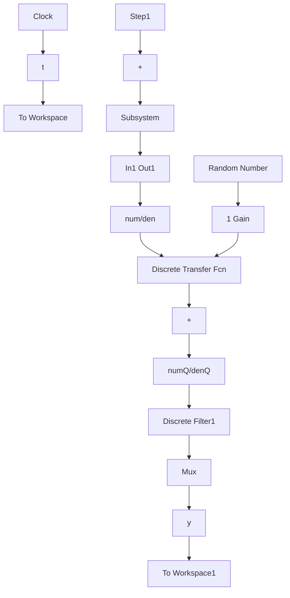
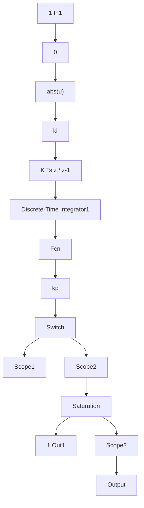

# 〖仿真程序〗

(1) 初始化程序: chap1\_19int.m

```matlab
clear all;
close all;

ts=0.001;
%Low Filter
Q=tf([1],[0.04,1]);
Qz=c2d(Q,ts,'tustin');
[numQ,denQ]=tfdata(Qz,'v');

%Plant 
```

```matlab
sys=tf(5.235e005,[1,87.35,1.047e004,0]);
dsys=c2d(sys,ts,'z');
[num,den]=tfdata(dsys,'v');
kp=0.20;
ki=0.05;
```

(2) Simulink 主程序: chap1\_19.mdl


<details>
<summary>flowchart</summary>


</details>

PI 控制器子程序如下:


<details>
<summary>flowchart</summary>


</details>

(3) 作图程序: chap1\_19plot.m

```txt
close all;
plot(t,y(:,1),'r',t,y(:,2),'k:',linewidth',2);
xlabel('time(s)');ylabel('yd,y');
legend('Ideal position signal','Position tracking'); 
```


