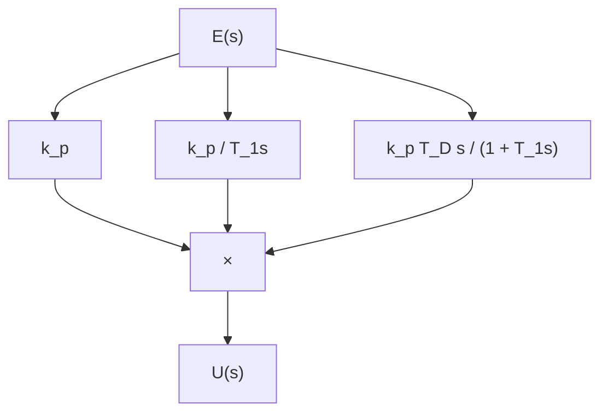
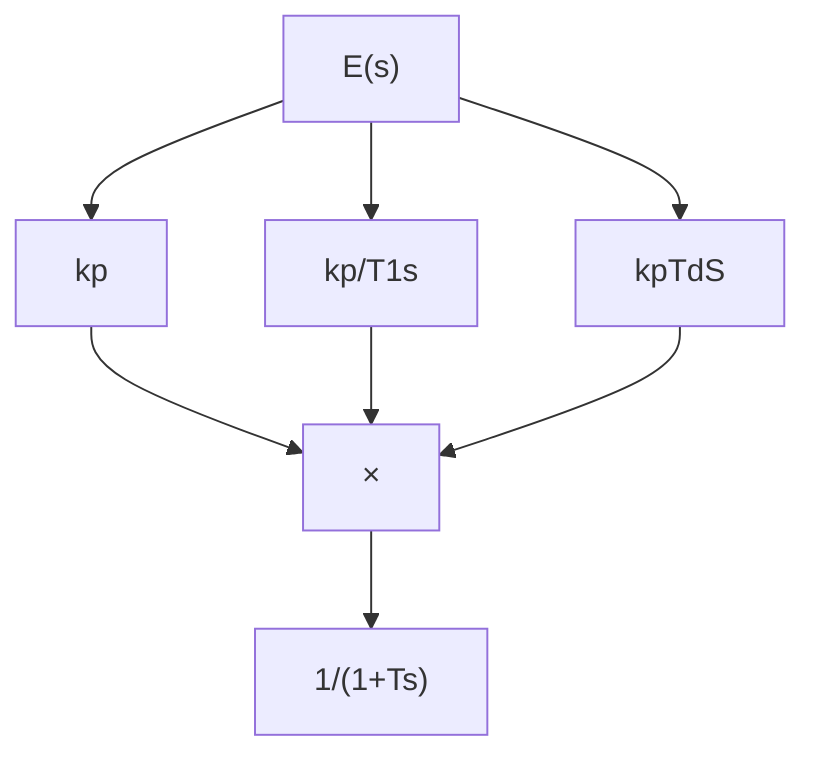

# 1.3.10 不完全微分 PID 控制算法及仿真

在 PID 控制中，微分信号的引入可改善系统的动态特性，但也易引进高频干扰，在误差扰动突变时尤其显出微分项的不足。若在控制算法中加入低通滤波器，则可使系统性能得到改善。

克服上述缺点的方法之一是在 PID 算法中加入一个一阶惯性环节（低通滤波器） $G_{\mathrm{f}}(s)=\frac{1}{1+T_{\mathrm{f}}s}$ ，可使系统性能得到改善。

不完全微分 PID 的结构如图 1-39（a）、（b）所示，其中图（a）是将低通滤波器直接加在微分环节上，图（b）是将低通滤波加在整个 PID 控制器之后。下面以图（a）为例进行仿真说明不完全微分 PID 如何改进了普通 PID 的性能。

flowchart

flowchart

图 1-39 不完全微分算法结构图

对图 1-39（a）所示的不完全微分结构，其传递函数为

$$U (s) = \left(k _ {\mathrm{p}} + \frac {k _ {\mathrm{p}} / T _ {\mathrm{I}}}{s} + \frac {k _ {\mathrm{p}} T _ {\mathrm{D}} s}{T _ {\mathrm{f}} s + 1}\right) E (s) = u _ {\mathrm{p}} (s) + u _ {\mathrm{I}} (s) + u _ {\mathrm{D}} (s) \tag {1.14}$$

将式（1.14）离散化为

$$u (k) = u _ {_ \mathrm{p}} (k) + u _ {_ \mathrm{l}} (k) + u _ {_ \mathrm{D}} (k) \tag {1.15}$$

现将 $u_{\mathrm{D}}(k)$ 推导

$$u _ {\mathrm{D}} (s) = \frac {k _ {\mathrm{p}} T _ {\mathrm{D}} s}{T _ {\mathrm{f}} s + 1} E (s) \tag {1.16}$$

写成微分方程为

$$u _ {\mathrm{D}} (k) + T _ {\mathrm{f}} \frac {\mathrm{d} u _ {\mathrm{D}} (t)}{\mathrm{d} t} = k _ {\mathrm{p}} T _ {\mathrm{D}} \frac {\mathrm{derror} (t)}{\mathrm{d} t}$$

取采样时间为 $T_{s}$ ，将上式离散化为

$$u _ {\mathrm{D}} (k) + T _ {\mathrm{f}} \frac {u _ {\mathrm{D}} (k) - u _ {\mathrm{D}} (k - 1)}{T _ {\mathrm{s}}} = k _ {\mathrm{p}} T _ {\mathrm{D}} \frac {\mathrm{error} (k) - \mathrm{error} (k - 1)}{T _ {\mathrm{s}}} \tag {1.17}$$

经整理得

$$u _ {\mathrm{D}} (k) = \frac {T _ {\mathrm{f}}}{T _ {\mathrm{s}} + T _ {\mathrm{f}}} u _ {\mathrm{D}} (k - 1) + k _ {\mathrm{p}} \frac {T _ {\mathrm{D}}}{T _ {\mathrm{s}} + T _ {\mathrm{f}}} (\text { error } (k) - \text { error } (k - 1)) \tag {1.18}$$

令 $\alpha = \frac{T_{\mathrm{f}}}{T_{\mathrm{s}} + T_{\mathrm{f}}}$ ，则 $\frac{T_{\mathrm{s}}}{T_{\mathrm{s}} + T_{\mathrm{f}}} = 1 - \alpha$ ，显然有 $\alpha < 1$ ， $1 - \alpha < 1$ 成立，则可得不完全微分算法

$$u _ {\mathrm{D}} (k) = K _ {\mathrm{D}} (1 - \alpha) (\text { error } (k) - \text { error } (k - 1)) + \alpha u _ {\mathrm{D}} (k - 1) \tag {1.19}$$

式中， $K_{D}=k_{p}\cdot T_{D}/T_{s}$ 。

可见，不完全微分的 $u_{\mathrm{D}}(k)$ 多了一项 $\alpha u_{\mathrm{D}}(k-1)$ ，而原微分系数由 $k_{\mathrm{d}}$ 降至 $k_{\mathrm{d}}(1-\alpha)$ 。

以上各式中， $T_{s}$ 为采样时间， $\Delta t = T_{s}$ ， $k_{p}$ 为比例系数， $T_{I}$ 和 $T_{D}$ 分别为积分时间常数和微分时间常数， $T_{f}$ 为滤波器系数。
