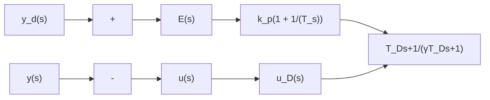

# 1.3.11 微分先行 PID 控制算法及仿真

微分先行 PID 控制的结构如图 1-42 所示，其特点是只对输出量 $y(k)$ 进行微分，而对给定值 $y_{\mathrm{d}}(k)$ 不作微分。这样，在改变给定值时，输出不会改变，而被控量的变化通常是比较缓和的。这种输出量先行微分控制适用于给定值 $y_{\mathrm{d}}(k)$ 频繁升降的场合，可以避免给定值升降时所引起的系统振荡，从而明显地改善了系统的动态特性。

令微分部分的传递函数为

$$\frac {u _ {\mathrm{D}} (s)}{y (s)} = \frac {T _ {\mathrm{D}} s + 1}{\gamma T _ {\mathrm{D}} s + 1} \quad \gamma < 1 \tag {1.20}$$

式中， $\frac{1}{\gamma T_{D}s+1}$ 相当于低通滤波器。

flowchart

图 1-42 微分先行 ID 控制结构图

则

$$\gamma T _ {\mathrm{D}} \frac {\mathrm{d} u _ {\mathrm{D}}}{\mathrm{d} t} + u _ {\mathrm{D}} = T _ {\mathrm{D}} \frac {\mathrm{d} y}{\mathrm{d} t} + y \tag {1.21}$$

由差分得

$$\frac {\mathrm{d} u _ {\mathrm{D}}}{\mathrm{d} t} \approx \frac {u _ {\mathrm{D}} (k) - u _ {\mathrm{D}} (k - 1)}{T}\frac {\mathrm{d} y}{\mathrm{d} t} \approx \frac {y (k) - y (k - 1)}{T}\gamma T _ {\mathrm{D}} \frac {u _ {\mathrm{D}} (k) - u _ {\mathrm{D}} (k - 1)}{T} + u _ {\mathrm{D}} (k) = T _ {\mathrm{D}} \frac {y (k) - y (k - 1)}{T} + y (k)u _ {\mathrm{D}} (k) = \left(\frac {\gamma T _ {\mathrm{D}}}{\gamma T _ {\mathrm{D}} + T}\right) u _ {\mathrm{D}} (k - 1) + \left(\frac {T _ {\mathrm{D}} + T}{\gamma T _ {\mathrm{D}} + T}\right) y (k) - \left(\frac {T _ {\mathrm{D}}}{\gamma T _ {\mathrm{D}} + T}\right) y (k - 1)u _ {\mathrm{D}} (k) = c _ {1} u _ {\mathrm{D}} (k - 1) + c _ {2} \mathrm{y} (k) - c _ {3} \mathrm{y} (k - 1) \tag {1.22}$$

式中，

$$c _ {1} = \frac {\gamma T _ {\mathrm{D}}}{\gamma T _ {\mathrm{D}} + T}, c _ {2} = \frac {T _ {\mathrm{D}} + T}{\gamma T _ {\mathrm{D}} + T}, c _ {1} = \frac {T _ {\mathrm{D}}}{\gamma T _ {\mathrm{D}} + T} \tag {1.23}$$

PI 控制部分传递函数为

$$\frac {u _ {\mathrm{PI}} (s)}{E (s)} = k _ {\mathrm{p}} \left(1 + \frac {1}{T _ {1} s}\right) \tag {1.24}$$

式中， $T_{1}$ 为积分时间常数。

离散控制律为

$$u (k) = u _ {\mathrm{PI}} (k) + u _ {\mathrm{D}} (k) \tag {1.25}$$
