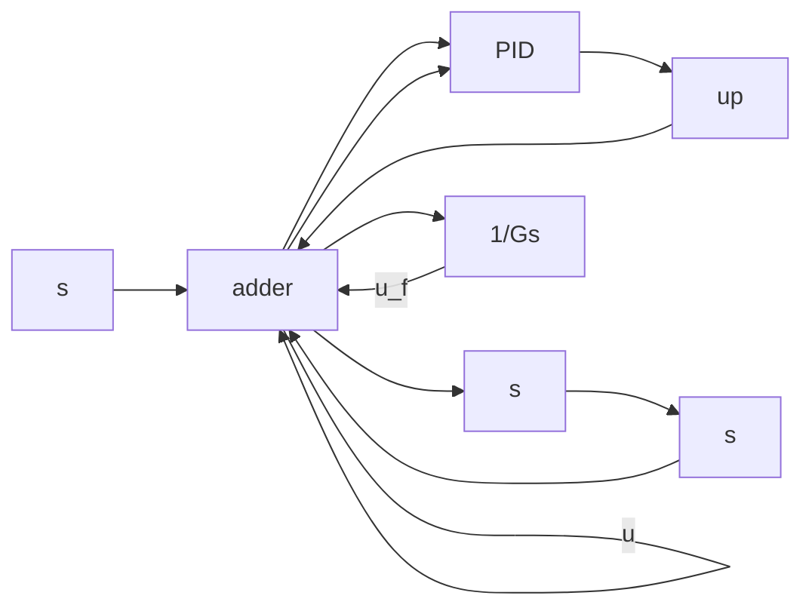

# 1.3.13 基于前馈补偿的 PID 控制算法及仿真

在高精度伺服控制中，前馈控制可用来提高系统的跟踪性能。经典控制理论中的前馈控制设计是基于复合控制思想，当闭环系统为连续系统时，使前馈环节与闭环系统的传递函数之积为1，从而实现输出完全复现输入。作者利用前馈控制的思想，针对PID控制设计了前馈补偿，以提高系统的跟踪性能，其结构如图1-48所示。

flowchart

图 1-48 PID 前馈控制结构

设计前馈补偿控制器为

$$u _ {\mathrm{f}} (s) = y _ {\mathrm{d}} (s) \frac {1}{G (s)} \tag {1.27}$$

总控制输出为 PID 控制输出 + 前馈控制输出

$$u (t) = u _ {\mathrm{p}} (t) + u _ {\mathrm{f}} (t) \tag {1.28}$$

写成离散形式为

$$u (k) = u _ {\mathrm{p}} (k) + u _ {\mathrm{f}} (k) \tag {1.29}$$
