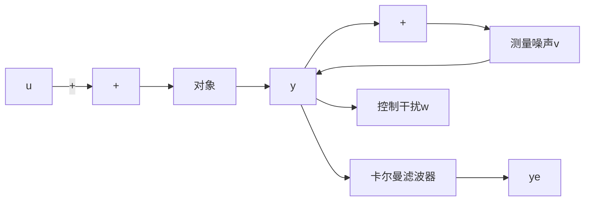

# 1. 卡尔曼滤波器原理

在现代随机最优控制和随机信号处理技术中，信号和噪声往往是多维非平稳随机过程。

因其时变性，功率谱不固定。在 1960 年年初提出了卡尔曼滤波理论，该理论采用时域上的递推算法在数字计算机上进行数据滤波处理。

对于离散域线性系统

$$x (k) = A x (k - 1) + B (u (k) + w (k)) \tag {1.30}y _ {v} (k) = C x (k) + v (k)$$

式中， $w(k)$ 为过程噪声信号， $v(k)$ 为测量噪声信号。

离散卡尔曼滤波器递推算法为

$$M _ {\mathrm{n}} (k) = \frac {P (k) \mathrm{C} ^ {\mathrm{T}}}{C P (k) C ^ {\mathrm{T}} + R} \tag {1.31}P (k) = A P (k - 1) A ^ {\mathrm{T}} + B Q B ^ {\mathrm{T}} \tag {1.32}P (k) = (I _ {n} - M _ {n} (k) C) P (k) \tag {1.33}x (k) = A x (k - 1) + M _ {\mathrm{n}} (k) \left(y _ {\mathrm{v}} (k) - C A x (k - 1)\right) \tag {1.34}y _ {\mathrm{e}} (k) = C x (k) \tag {1.35}$$

误差的协方差为

$$\operatorname{errcov} (k) = C P (k) C ^ {\mathrm{T}} \tag {1.36}$$

卡尔曼滤波器结构如图 1-56 所示。

flowchart

图 1-56 卡尔曼滤波器结构图
