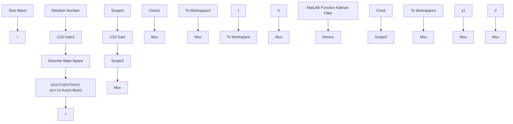

# 〖仿真程序〗

(1) Simulink 主程序: chap1\_27.mdl


<details>
<summary>flowchart</summary>


</details>

(2) Kalman 滤波子程序: chap1\_27f.m

```matlab
%Discrete Kalman filter
%x=Ax+B(u+w(k));
%y=Cx+D+v(k)
function [u]=kalman(u1,u2,u3)
persistent A B C D Q R P x

yv=u2;
if u3==0
    x=zeros(2,1);
    ts=0.001;
    a=25;b=133;
    sys=tf(b,[1,a,0]);
    A1=[0 1;0 -a];
    B1=[0;b];
    C1=[1 0];
    D1=[0];
```

```matlab
[A,B,C,D]=c2dm(A1,B1,C1,D1,ts,'z');
Q=1; %Covariances of w
R=1; %Covariances of v
P=B*Q*B'; %Initial error covariance
end

%Measurement update
Mn=P*C'/(C*P*C'+R);
x=A*x+Mn*(yv-C*A*x);
P=(eye(2)-Mn*C)*P;
ye=C*x+D; %Filtered value
u(1)=ye; %Filtered signal
u(2)=yv; %Signal with noise
errcov=C*P*C'; %Covariance of estimation error
%Time update
x=A*x+B*u1;
P=A*P*A'+B*Q*B'; 
```

（3）作图程序：chap1\_27plot.m

```matlab
close all;
figure(1);
plot(t,y(:,1),'r',t,y(:,2),'k:','linewidth',2);
xlabel('time(s)');ylabel('y,ye');
legend('ideal signal','filtered signal');
figure(2);
plot(t,y(:,1),'r',t,yl(:,1),'k:','linewidth',2);
xlabel('time(s)');ylabel('y,yv');
legend('ideal signal','signal with noise'); 
```
