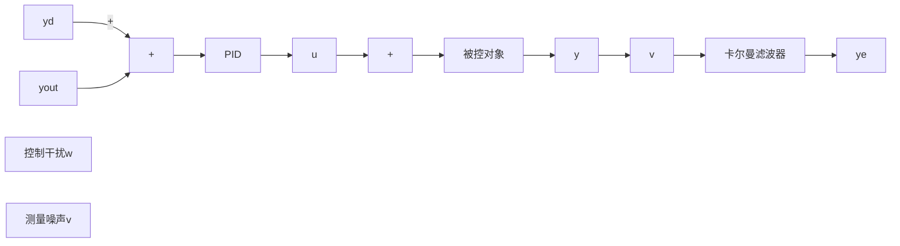

# 2. 基于卡尔曼滤波器的 PID 控制

基于卡尔曼（Kalman）滤波的 PID 控制系统结构如图 1-62 所示。

flowchart

```mermaid
graph LR
    yd -->|+| A["+"]
    A --> PID["PID"]
    PID --> u
    u --> C["+"]
    C --> 被控对象["被控对象"]
    被控对象 --> y
    y --> v
    v --> 卡尔曼滤波器["卡尔曼滤波器"]
    卡尔曼滤波器 --> ye
    yout --> A
    控制干扰w["控制干扰w"]
    测量噪声v["测量噪声v"]
```

图 1-62 基于卡尔曼滤波的 PID 控制
