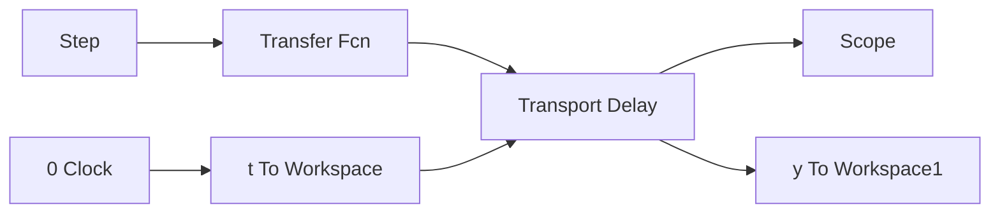

# (1) 对象开环测试

① Simulink 主程序：chap2\_1sim.mdl


<details>
<summary>flowchart</summary>


</details>

② 作图程序：chap2\_1plot.m

```matlab
close all;
figure (1);
plot(t,y(:,1),'k','linewidth',2);
xlabel('time(s)');ylabel('y'); 
```
