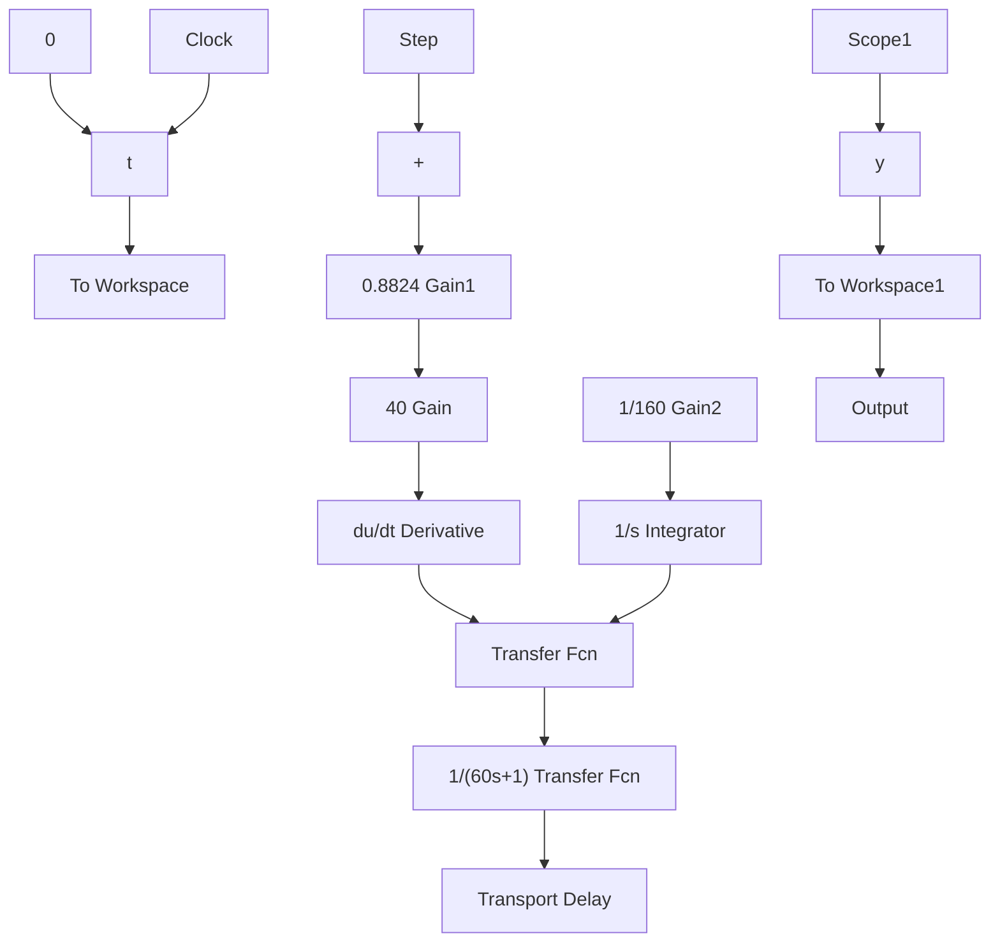

# (2) 连续 PID 控制仿真

① Simulink 主程序：chap2\_2sim.mdl


<details>
<summary>flowchart</summary>


</details>

② 作图程序：chap2\_2plot.m

```matlab
close all;
figure(1);
plot(t,y(:,1),'r',t,y(:,2),'k:',linewidth',2);
xlabel('time(s)');ylabel('yd and y');
legend('ideal position signal','position tracking'); 
```

(3) 离散 PID 控制仿真: chap2\_3.m

```matlab
clear all;
close all;
Ts=20;
%Delay plant 
```

```matlab
K=1;
Tp=60;
tol=80;
sys=tf([K],[Tp,1],'inputdelay',tol);
dsys=c2d(sys,Ts,'zoh');
[num,den]=tfdata(dsys,'v');

u_1=0.0;u_2=0.0;u_3=0.0;u_4=0.0;u_5=0.0;
e_1=0;
ei=0;
y_1=0.0;
for k=1:1:300
time(k)=k*Ts;

yd(k)=1.0;    %Tracing Step Signal

y(k)=-den(2)*y_1+num(2)*u_5;

e(k)=yd(k)-y(k);
de(k)=(e(k)-e_1)/Ts;
ei=ei+Ts*e(k);

delta=0.885;
TI=160;
TD=40;

u(k)=delta*(e(k)+1/TI*ei+TD*de(k));

e_1=e(k);
u_5=u_4;u_4=u_3;u_3=u_2;u_2=u_1;u_1=u(k);
y_1=y(k);
end

figure(1);
plot(time,yd,'r',time,y,'k:',linewidth',2);
xlabel('time(s)');ylabel('yd and y');
legend('ideal position signal','position tracking'); 
```


