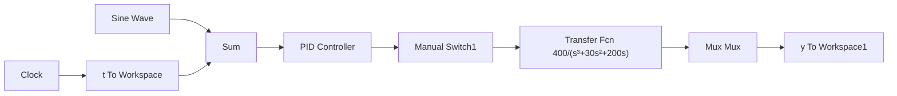

wm=imag(pole(2));
kp=0.6*km
kd=kp*pi/(4*wm)
ki=kp*wm/pi

figure(2);
grid on;
bode(sys,'r');

sys_pid=tf([kd,kp,ki],[1,0])
sysc=series(sys,sys_pid)
hold on;
bode(sysc,'b')

figure(3);
rlocus(sysc); 
```

(2) Simulink 主程序: chap2\_4sim.mdl


<details>
<summary>flowchart</summary>


</details>

（3）作图程序：chap2\_4plot.m

```javascript
close all;
plot(t,y(:,1),'r',t,y(:,2),'k:','linewidth',2);
xlabel('time(s)');ylabel('position signal');
legend('ideal position signal','position tracking'); 
```


