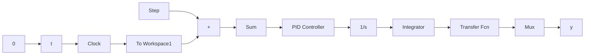

# 〖仿真程序〗

(1) 初始化程序: chap2\_6int.m

```txt
clear all;
close all;
K=10;
```

```matlab
tol=1.0;
M=3;
if M==1
    Kp=10;Kd=10;
elseif M==2
    Kp=10;Kd=20;
elseif M==3
    Kp=20;Kd=10;
end 
```

(2) Simulink 主程序: chap2\_6sim.mdl


<details>
<summary>flowchart</summary>


</details>

（3）作图程序：chap2\_6plot.m

```matlab
close all;
figure(1);
plot(t,y(:,1),'r',t,y(:,2),'k','linewidth',2);
xlabel('time');ylabel('Step response');
if M==1
    title('M=1:Kp=10,Kd=10');
elseif M==2
    title('M=2:Kp=10,Kd=20');
elseif M==3
    title('M=3:Kp=20,Kd=10');
end 
```


