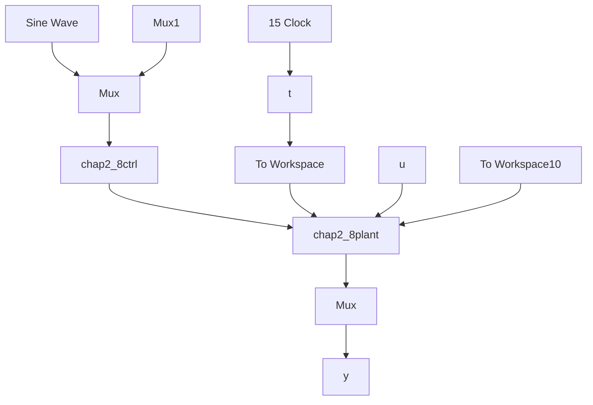

# 〖仿真程序〗

(1) Simulink 主程序: chap2\_8sim.mdl


<details>
<summary>flowchart</summary>


</details>

(2) 控制器子程序: chap2\_8ctrl.m

```matlab
switch flag,
case 0,
    [sys,x0,str,ts]=mdlInitializeSizes;
case 3,
    sys=mdlOutputs(t,x,u);
case {2,4,9}
    sys=[];
otherwise
    error(['Unhandled flag = ',num2str(flag)]);
end
function [sys,x0,str,ts]=mdlInitializeSizes
sizes = simsizes;
sizes.NumContStates = 0;
sizes.NumDiscStates = 0;
sizes.NumOutputs = 1;
sizes.NumInputs = 3;
sizes.DirFeedthrough = 1;
sizes.NumSampleTimes = 0;
sys = simsizes(sizes);
x0 = [];
str = [];
ts = [];
function sys=mdlOutputs(t,x,u)
thd=u(1);
dthd=cos(t);
ddthd=-sin(t);

th=u(2);
dth=u(3);

e=th-thd;
de=dth-dthd;

a=25;
b=133;

k=3;
kp=k^2;
kd=2*k-a;

ut=1/b*(-kp*e-kd*de+a*dthd+ddthd);
sys(1)=ut; 
```

(3) 被控对象子程序: chap2\_8plant.m  
```txt
function [sys,x0,str,ts]=s_function(t,x,u,flag)
switch flag,
case 0,
[sys,x0,str,ts]=mdlInitializeSizes;
case 1, 
```

```matlab
sys=mdlDerivatives(t,x,u);
case 3,
    sys=mdlOutputs(t,x,u);
case {2, 4, 9}
    sys = [];
otherwise
    error(['Unhandled flag = ',num2str(flag)]);
end
function [sys,x0,str,ts]=mdlInitializeSizes
sizes = simsizes;
sizes.NumContStates = 2;
sizes.NumDiscStates = 0;
sizes.NumOutputs = 2;
sizes.NumInputs = 1;
sizes.DirFeedthrough = 0;
sizes.NumSampleTimes = 0;
sys=simsizes(sizes);
x0=[-0.15 -0.15];
str=[];
ts=[];
function sys=mdlDerivatives(t,x,u)
sys(1)=x(2);
sys(2)=-25*x(2)+133*u;
function sys=mdlOutputs(t,x,u)
sys(1)=x(1);
sys(2)=x(2); 
```

（4）作图子程序：chap2\_8plot.m  
```matlab
close all;

figure(1);
plot(t,y(:,1),'r',t,y(:,2),'k:','linewidth',2);
xlabel('time(s)');ylabel('Position tracking');
axis([0 15 -1.5 2]);
legend('Ideal position signal','position tracking','location','NorthEast');
figure(2);
plot(t,u(:,1),'r','linewidth',2);
xlabel('time(s)');ylabel('Control input'); 
```


