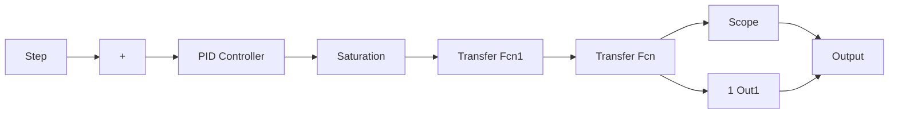

# 2.9.2 仿真实例

被控对象为

$$G (s) = \frac {5 0 s + 5 0}{s ^ {3} + s ^ {2} + s}$$

控制输入限制在[-5, 5]，分两步来实现 PID 的整定：首先运行主程序 chap2\_11main.m，初始化的参数为 $k_{\mathrm{p}} = 0$ ， $k_{\mathrm{i}} = 0$ ， $k_{\mathrm{d}} = 0$ ，上下界分别取为 LB=[0 0 0]，UB=[100 100 100]，在运行过程中可通过 Simulink 程序中的 scope 窗口观察到动态优化过程，优化结果为 $k_{p}=1.3814$ ， $k_{i}=0.0014$ ， $k_{d}=0.1787$ ；然后采用优化后的 PID 参数运行 Simulink 程序 chap2\_11sim.mdl，优化后的阶跃响应如图 2-29 所示。


<details>
<summary>line</summary>

| Time offset | Value |
| --- | --- |
| 0 | 0 |
| 0.5 | 1.1 |
| 1.0 | 1.0 |
| 1.5 | 1.0 |
| 2.0 | 1.0 |
| 2.5 | 1.0 |
| 3.0 | 1.0 |
| 3.5 | 1.0 |
| 4.0 | 1.0 |
| 4.5 | 1.0 |
| 5.0 | 1.0 |
</details>

图 2-29 采用优化函数整定的阶跃响应

〖仿真程序〗 分为主程序、M 函数子程序和 Simulink 子程序三个部分。

(1) 主程序: chap2\_11main.m

```matlab
clear all;
close all;
K_pid0=[0 0 0];
LB=[0 0 0];
UB=[100 100 100];
K_pid=lsqnonlin('chap2_11plant', K_pid0, LB, UB);
chap2_11sim
```

(2) M 函数子程序: chap2\_11plant.m

```matlab
function e=pid_eq(K_pid)
assignin('base','kp',K_pid(1));
assignin('base','ki',K_pid(2));
assignin('base','kd',K_pid(3));
opt=simset('solver','ode5');
[tout,xout,y]=sim('chap2_11sim',[0 10],opt);
r=1.0;
e=r-y; 
```

(3) Simulink 子程序: chap2\_11sim.mdl


<details>
<summary>flowchart</summary>


</details>


