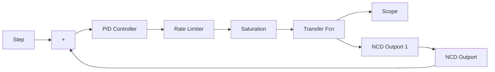

# 『仿真程序』

(1) 初始化程序: chap2\_12int.m

```matlab
clear all;
close all;
kp=1;ki=0.10;kd=10;
a2=43;
a1=3;
```

(2) Simulink 主程序: chap2\_12sim.mdl


<details>
<summary>flowchart</summary>


</details>


