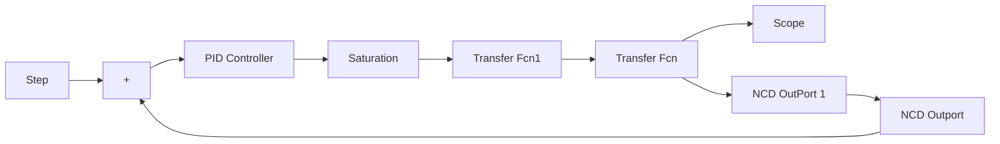

```matlab
function e=pid_eq(K_pid)
assignin('base','kp',K_pid(1));
assignin('base','ki',K_pid(2));
assignin('base','kd',K_pid(3));
opt=simset('solver','ode5');
[tout,xout,y]=sim('chap2_13sim',[0 10],opt);
r=1.0;
e=r-y; 
```

(3) Simulink 子程序: chap2\_13sim.mdl


<details>
<summary>flowchart</summary>


</details>


