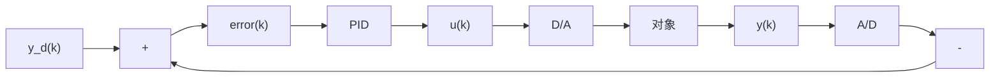

# 3.1 单回路 PID 控制系统

系统只有一个 PID 控制器，如图 3-1 所示。本书所述的大部分内容都是关于单回路 PID 控制系统的。

flowchart

```mermaid
graph LR
    A["y_d(k)"] --> B["+"]
    B --> C["error(k)"]
    C --> D["PID"]
    D --> E["u(k)"]
    E --> F["D/A"]
    F --> G["对象"]
    G --> H["y(k)"]
    H --> I["A/D"]
    I --> J["-"]
    J --> B
```

图 3-1 单回路 PID 控制系统

单回路 PID 控制系统的 MATLAB 仿真见第 1 章。

