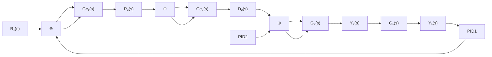

# 3.2.1 串级 PID 控制原理

串级计算机控制系统的典型结构如图 3-2 所示，系统中有两个 PID 控制器， $G_{\mathrm{c}2}(s)$ 称为副调节器传递函数，包围 $G_{\mathrm{c}2}(s)$ 的内环称为副回路。 $G_{\mathrm{c}1}(s)$ 称为主调节器传递函数，包围 $G_{\mathrm{c}1}(s)$ 的外环称为主回路。主调节器的输出控制量 $u_{1}$ 作为副回路的给定量 $R_{2}(s)$ 。

flowchart

图 3-2 串级控制系统框图

串级控制系统的计算顺序是先主回路（PID1），后副回路（PID2）。控制方式有两种：一种是异步采样控制，即主回路的采样控制周期 $T_{1}$ 是副回路采样控制周期 $T_{2}$ 的整数倍。这是因为一般串级控制系统中主控对象的响应速度慢、副控对象的响应速度快的缘故。另一种是同步采样控制，即主、副回路的采样控制周期相同。这时，应根据副回路选择采样周期，因为副回路的受控对象的响应速度较快。

串级控制的主要优点 $^{[1]}$ :

（1）将干扰加到副回路中，由副回路控制对其进行抑制；  
（2）副回路中参数的变化，由副回路给予控制，对被控量 $G_{1}$ 的影响大为减弱；  
（3）副回路的惯性由副回路给予调节，因而提高了整个系统的响应速度。

副回路是串级系统设计的关键。副回路设计的方式有很多种，下面介绍按预期闭环特性设计副调节器的设计方法。

由副回路框图可得副回路闭环系统的传递函数为

$$\varphi_ {2} (z) = \frac {Y _ {2} (z)}{U _ {1} (z)} = \frac {G _ {\mathrm{c2}} (z) G _ {2} (z)}{1 + G _ {\mathrm{c2}} (z) G _ {2} (z)} \tag {3.1}$$

可得副调节器控制律

$$G _ {\mathrm{c2}} (z) = \frac {\varphi_ {2} (z)}{G _ {2} (z) (1 - \varphi_ {2} (z))} \tag {3.2}$$

一般选择

$$\varphi_ {2} (z) = z ^ {- n} \tag {3.3}$$

式中，n 为 $G_{2}(z)$ 有理多项式分母最高次幂。

