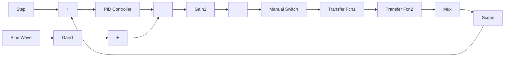

# 『仿真程序』

(1) Simulink 主程序: chap3\_2sim.mdl


<details>
<summary>flowchart</summary>


</details>

(2) 作图程序: chap3\_2plot.m

```matlab
close all;
plot(t,y(:,1),'r',t,y(:,2),'k:',linewidth',2);
xlabel('time(s)');ylabel('r and y');
legend('ideal position signal','position tracking'); 
```


