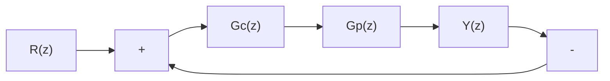

# 3.3.1 大林控制算法原理

早在 1968 年，美国 IBM 公司的大林（Dahlin）就提出了一种不同于常规 PID 控制规律的新型算法，即大林算法。该算法的最大特点是将期望的闭环响应设计成一阶惯性加纯延迟，然后反过来得到能满足这种闭环响应的控制器 $^{[1]}$ 。

对于图 3-8 所示的单回路控制系统， $G_{\mathrm{c}}(z)$ 为数字控制器， $G_{\mathrm{p}}(z)$ 为被控对象，则闭环系统传递函数为

$$\phi (z) = \frac {Y (z)}{R (z)} = \frac {G _ {\mathrm{c}} (z) G _ {\mathrm{p}} (z)}{1 + G _ {\mathrm{c}} (z) G _ {\mathrm{p}} (z)} \tag {3.4}$$

flowchart

图 3-8 单回路控制系统框图

则

$$G _ {\mathrm{c}} (z) = \frac {U (z)}{E (z)} = \frac {1}{G _ {\mathrm{p}} (z)} \frac {\phi (z)}{1 - \phi (z)} \tag {3.5}$$

如果能事先设定系统的闭环响应 $\phi(z)$ ，则可得控制器 $G_{\mathrm{c}}(z)$ 。大林指出，通常的期望闭环响应是一阶惯性加纯延迟形式，其延迟时间等于对象的纯延迟时间 $\tau$ 。

$$\phi (s) = \frac {Y (s)}{R (s)} = \frac {\mathrm{e} ^ {- \tau s}}{T _ {\varphi} s + 1} \tag {3.6}$$

式中， $T_{\varphi}$ 为闭环系统的时间常数，由此而得到的控制律称为大林算法。

