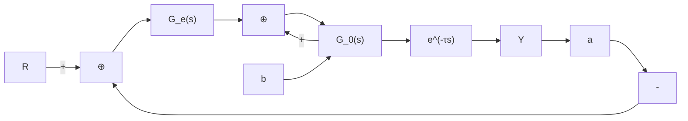
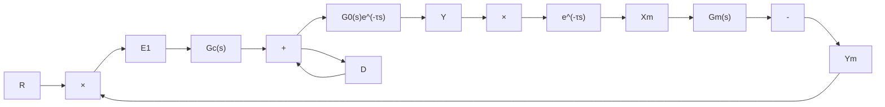

# 3.4.1 连续 Smith 预估控制

带有纯延迟的单回路控制系统如图 3-11 所示，其闭环传递函数为

$$\phi (s) = \frac {Y (s)}{R (s)} = \frac {G _ {\mathrm{c}} (s) G _ {0} (s) \mathrm{e} ^ {- \tau s}}{1 + G _ {\mathrm{c}} (s) G _ {0} (s) \mathrm{e} ^ {- \tau s}} \tag {3.7}$$

其特征方程为

$$1 + G _ {\mathrm{c}} (s) G _ {0} (s) \mathrm{e} ^ {- \tau s} = 0 \tag {3.8}$$


<details>
<summary>flowchart</summary>


</details>

图 3-11 有纯延迟的单回路控制系统

可见，特征方程中出现了纯延迟环节，使系统稳定性降低，如果 $\tau$ 足够大，系统将不稳定，这就是大延迟过程难于控制的本质。而 $\mathrm{e}^{-\tau s}$ 之所以在特征方程中出现，是由于反馈信号是从系统的a点引出来的，若能将反馈信号从b点引出，则把纯延迟环节移到控制回路的外边，如图3-12所示，经过 $\tau$ 的延迟时间后，被调量 $Y$ 将重复 $X$ 同样的变化。


<details>
<summary>flowchart</summary>

```mermaid
graph LR
    R --> |+| A["×"]
    A --> Gc["Gc(s)"]
    Gc --> |+| B["×"]
    D --> |+| B
    B --> G0["G0(s)"]
    G0 --> X["X"]
    X --> e^(-τs)
    e^(-τs) --> Y
    Y --> |feedback| A
```
</details>

图 3-12 改进的有纯延迟的单回路控制系统

由于反馈信号 X 没有延迟，系统的响应会大大地改善。但在实际系统中，b 点或是不存在，或是受物理条件的限制，无法从 b 点引出反馈信号来。针对这种问题，Smith 提出采用人造模型的方法，构造如图 3-13 所示的控制系统。


<details>
<summary>flowchart</summary>

```mermaid
graph LR
    R -->|+| A["×"]
    A --> E1
    E1 -->|+| B["×"]
    B --> E2
    E2 --> Gc["s"]
    Gc["s"] --> U
    U -->|+| C["×"]
    C --> G0["s"]
    G0["s"] --> e^(-τs)
    e^(-τs) --> Y
    Y -->|-| D
    D -->|+| C
    C --> Gm["s"]
    Gm["s"] --> Xm
    Xm --> e^(-τs)
    e^(-τs) --> Em
    Em -->|-| A
```
</details>

图 3-13 Smith 预估控制系统

如果模型是精确的，即 $G_{0}(s) = G_{\mathrm{m}}(s),\tau = \tau_{\mathrm{m}}$ ，且不存在负荷扰动（ $D = 0$ ），则 $Y = Y_{\mathrm{m}}$ ， $E_{\mathrm{m}} = Y - Y_{\mathrm{m}} = 0$ ， $X = X_{\mathrm{m}}$ ，则可以用 $X_{\mathrm{m}}$ 代替 $X$ 作第一条反馈回路，实现将纯延迟环节移到控制回路的外边。如果模型是不精确的或是出现负荷扰动，则 $X$ 就不等于 $X_{\mathrm{m}}$ $E_{\mathrm{m}} = Y - Y_{\mathrm{m}}\neq 0$ ，控制精度也就不能令人满意。为此，采用 $E_{\mathrm{m}}$ 实现第二条反馈回路。这就是Smith预估器的控制策略。

实际上预估模型不是并联在过程上，而是反向并联在控制器上的，因此，将图 3-13 变换可得到 Smith 预估控制系统等效图，如图 3-14 所示。

显然，Smith 控制方法的前提是必须确切地知道被控对象的数学模型，在此基础上才能建立精确的预估模型。


<details>
<summary>flowchart</summary>


</details>

图 3-14 Smith 预估控制系统等效图


