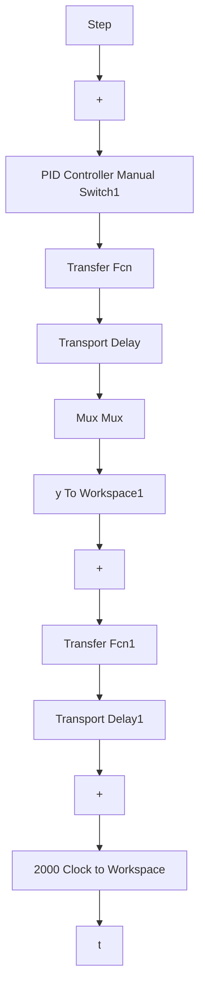

# 3.4.2 仿真实例

被控对象为

$$G _ {\mathrm{p}} (s) = \frac {\mathrm{e} ^ {- 8 0 s}}{6 0 s + 1}$$

采用 Smith 控制方法，按图 3-13 的结构进行设计。在 PI 控制中，取 $k_{p}=4.0$ ， $k_{i}=0.022$ ，假设预测模型精确，阶跃指令信号取 100。Simulink 仿真程序及仿真结果如图 3-15 和图 3-16 所示，仿真结果表明，Smith 控制方法具有很好的控制效果。


<details>
<summary>line</summary>

| time(s) | Ideal position signal | position tracking |
| --- | --- | --- |
| 0 | 0 | 0 |
| 100 | 85 | 85 |
| 200 | 95 | 95 |
| 400 | 98 | 98 |
| 600 | 99 | 99 |
| 800 | 99.5 | 99.5 |
| 1000 | 99.8 | 99.8 |
| 1200 | 99.9 | 99.9 |
| 1400 | 99.95 | 99.95 |
| 1600 | 99.98 | 99.98 |
| 1800 | 99.99 | 99.99 |
| 2000 | 100 | 100 |
</details>

图 3-15 采用 Smith 补偿的阶跃响应


<details>
<summary>line</summary>

| time(s) | Ideal position signal | position tracking |
| --- | --- | --- |
| 0 | 0 | 0 |
| 200 | 0 | 0 |
| 400 | 0 | 0 |
| 600 | 0 | 0 |
| 800 | 0 | 0 |
| 1000 | 0 | 0 |
| 1200 | 0 | 0 |
| 1400 | 0 | 0 |
| 1600 | 0 | 0 |
| 1800 | 0 | 0 |
| 2000 | 2e8 | 2e8 |
</details>

图 3-16 不用 Smith 补偿的阶跃响应

〖仿真程序〗 按图 3-13 设计 Smith 控制系统。

(1) Simulink 主程序: chap3\_4sim.mdl


<details>
<summary>flowchart</summary>


</details>

(2) 作图程序: chap3\_4plot.m

```matlab
close all;
figure(1);
plot(t,y(:,1),'r',t,y(:,2),'k:',linewidth',2);
xlabel('time(s)');ylabel('yd,y');
legend('Ideal position signal','position tracking'); 
```

采用 Smith 控制方法，按图 3-14 的结构进行设计。在 PI 控制中，取 $k_{p}=4.0$ ， $k_{i}=0.022$ ，假设预测模型精确，阶跃指令信号取 100。仿真结果如图 3-17 和图 3-18 所示，仿真结果表明，Smith 控制方法具有很好的控制效果。


<details>
<summary>line</summary>

| time(s) | ideal position signal | position tracking |
| --- | --- | --- |
| 0 | 0 | 0 |
| 200 | 0 | 0 |
| 400 | 0 | 0 |
| 600 | 0 | 0 |
| 800 | 0 | 0 |
| 1000 | 0 | 0 |
| 1200 | 0 | 0 |
| 1400 | 0 | 0 |
| 1600 | 0 | -0.1 |
| 1800 | 0 | 0.3 |
| 2000 | 0 | 1.7 |
</details>

图 3-17 不用 Smith 补偿的阶跃响应


<details>
<summary>line</summary>
