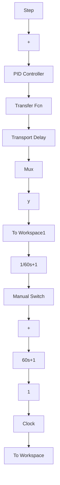

| time(s) | ideal position signal | position tracking |
| --- | --- | --- |
| 0 | 0 | 0 |
| 100 | 85 | 85 |
| 200 | 95 | 95 |
| 400 | 98 | 98 |
| 600 | 99 | 99 |
| 800 | 99.5 | 99.5 |
| 1000 | 99.8 | 99.8 |
| 1200 | 99.9 | 99.9 |
| 1400 | 99.95 | 99.95 |
| 1600 | 99.98 | 99.98 |
| 1800 | 99.99 | 99.99 |
| 2000 | 100 | 100 |
</details>

图 3-18 采用 Smith 补偿的阶跃响应

〖仿真程序〗 按图 3-14 设计 Smith 控制系统。

(1) Simulink 主程序: chap3\_5sim.md


<details>
<summary>flowchart</summary>


</details>

(2) 作图程序: chap3\_5plot.m

```javascript
close all;
figure(1);
plot(t,y(:,1),'r',t,y(:,2),'k:','linewidth',2);
xlabel('time(s)');ylabel('yd,y');
legend('ideal position signal','position tracking'); 
```


