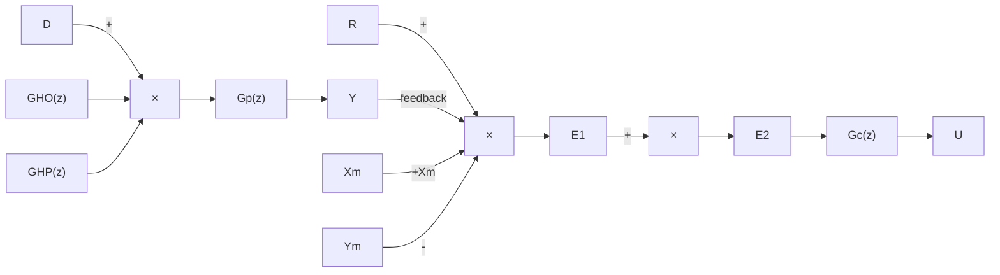

# 3.4.3 数字 Smith 预估控制

主要研究带有纯延迟的一阶过程在计算机控制时的史密斯预估控制算法的仿真。设被控对象的传递函数为

$$G _ {\mathrm{p}} (s) = \frac {k _ {\mathrm{p}} \mathrm{e} ^ {- \tau s}}{T _ {\mathrm{p}} s + 1} = G _ {\mathrm{Q}} (s) \mathrm{e} ^ {- \tau s} \tag {3.9}$$

被控对象离散化分别为 $G_{\mathrm{p}}(z)$ 和 $G_{0}(z)$ ，将 Smith 预估控制系统等效图 3-14 离散化，得到数字 Smith 预估控制系统框图，如图 3-19 所示。其中 $G_{\mathrm{HP}}(z)$ 和 $G_{\mathrm{HO}}(z)$ 分别为 $G_{\mathrm{p}}(z)$ 和

$G_{0}(z)$ 的估计模型。

flowchart

图 3-19 数字 Smith 预估控制系统框图

由图 3-19 可得

$$e _ {2} (k) = e _ {1} (k) - x _ {\mathrm{m}} (k) + y _ {\mathrm{m}} (k) = r (k) - y (k) - x _ {\mathrm{m}} (k) + y _ {\mathrm{m}} (k) \tag {3.10}$$

若模型是精确的，则

$$y (k) = y _ {\mathrm{m}} (k) \tag {3.11}e _ {2} (k) = r (k) - x _ {\mathrm{m}} (k) \tag {3.12}$$

$e_{2}(k)$ 为数字控制器 $G_{c}(z)$ 的输入， $G_{c}(z)$ 一般采用 PI 控制算法。

