# 〖仿真程序〗

(1) 初始化程序: chap3\_7int.m

```matlab
%Big Delay PID Control with Smith Algorithm
clear all; close all;
Ts=20;

%Delay plant
kp=1;
Tp=60;
tol=80;
sysP=tf([kp],[Tp,1],'inputdelay',tol); %Plant-
dsysP=c2d(sysP,Ts,'zoh');
[numP,denP]=tfdata(dsysP,'v'); 
```

(2) 仿真主程序: chap3\_7sim.mdl

```mermaid
graph TD
    A["Step"] --> B["+"]
    B --> C["Discrete PID Controller"]
    C --> D["numP(z)/denP(z)"]
    D --> E["-4 Z"]
    E --> F["Integer Delay"]
    F --> G["Discrete Transfer Fcn1"]
    G --> H["numP(z)/denP(z)"]
    H --> I["-4 Z"]
    I --> J["Integer Delay1"]
    J --> K["-4 Z"]
    K --> L["Manual Switch"]
    L --> B
    M["0 Clock"] --> N["t To Workspace"]
    N --> O["+"]
    O --> P["PID"]
    P --> Q["Discrete Transfer Fcn"]
    Q --> R["numP(z)/denP(z)"]
    R --> S["-4 Z"]
    S --> T["Integer Delay"]
    T --> U["-4 Z"]
    U --> V["numP(z)/denP(z)"]
    V --> W["-4 Z"]
    W --> X["Integer Delay1"]
    X --> Y["-4 Z"]
    Y --> Z["numP(z)/denP(z)"]
    Z --> AA["-4 Z"]
    AA --> AB["Integer Delay1"]
    AB --> AC["Discrete Transfer Fcn1"]
    AC --> AD["numP(z)/denP(z)"]
    AD --> AE["-4 Z"]
    AE --> AF["Integer Delay1"]
    AF --> AG["-4 Z"]
    AG --> AH["numP(z)/denP(z)"]
    AH --> AI["-4 Z"]
    AI --> AJ["Integer Delay1"]
    AJ --> AK["-4 Z"]
    AK --> AL["numP(z)/denP(z)"]
    AL --> AM["-4 Z"]
    AM --> AN["Integer Delay1"]
    AN --> AO["Discrete Transfer Fcn1"]
    AO --> AP["numP(z)/denP(z)"]
    AP --> AQ["-4 Z"]
    AQ --> AR["Integer Delay1"]
    AR --> AS["-4 Z"]
    AS --> AT["numP(z)/denP(z)"]
    AT --> AU["-4 Z"]
    AU --> AV["numP(z)/denP(z)"]
    AV --> AW["-4 Z"]
    AW --> AX["Integer Delay1"]
    AX --> AY["-4 Z"]
    AY --> AZ["numP(z)/denP(z)"]
    AZ --> BA["-4 Z"]
    BA --> BB["numP(z)/denP(z)"]
    BB --> BC["-4 Z"]
    BC --> BD["numP(z)/denP(z)"]
    BD --> BE["-4 Z"]
    BE --> BF["numP(z)/denP(z)"]
    BF --> BG["-4 Z"]
    BG --> BH["numP(z)/denP(z)"]
    BH --> BI["-4 Z"]
    BI --> BJ["numP(z)/denP(z)"]
    BJ --> BK["-4 Z"]
    BK --> BL["numP(z)/denP(z)"]
    BL --> BM["-4 Z"]
    BM --> BN["numP(z)/denP(z)"]
    BN --> BO["-4 Z"]
    BO --> BP["numP(z)/denP(z)"]
    BP --> BQ["-4 Z"]
    BQ --> BR["numP(z)/denP(z)"]
    BR --> BS["-4 Z"]
    BS --> BT["numP(z)/denP(z)"]
    BT --> BU["-4 Z"]
    BU --> BV["numP(z)/denP(z)"]
    BV --> BW["-4 Z"]
    BW --> BX["numP(z)/denP(z)"]
    BX --> BY["-4 Z"]
    BY --> BZ["numP(z)/denP(z)"]
    BZ --> CA["-4 Z"]
    CA --> CB["numP(z)/denP(z)"]
    CB --> CC["-4 Z"]
    CC --> CD["numP(z)/denP(z)"]
    CD --> CE["-4 Z"]
    CE --> CF["numP(z)/denP(z)"]
    CF --> CG["-4 Z"]
    CG --> CH["numP(z)/denP(z)"]
    CH --> CI["-4 Z"]
    CI --> CJ["numP(z)/denP(z)"]
    CJ --> CK["-4 Z"]
    CK --> CL["numP(z)/denP(z)"]
    CL --> CM["-4 Z"]
    CM --> CN["numP(z)/denP(z)"]
    CN --> CO["-4 Z"]
    CO --> CP["numP(z)/denP(z)"]
    CP --> CQ["-4 Z"]
    CQ --> CR["numP(z)/denP(z)"]
    CR --> CS["-4 Z"]
    CS --> CT["numP(z)/denP(z)"]
    CT --> CU["-4 Z"]
    CU --> CV["numP(z)/denP(z)"]
    CV --> CW["-4 Z"]
    CW --> CX["numP(z)/denP(z)"]
    CX --> CY["-4 Z"]
    CY --> CZ["numP(z)/denP(z)"]
    CZ --> DA["-4 Z"]
    DA --> DB["numP(z)/denP(z)"]
    DB --> DC["-4 Z"]
    DC --> DD["numP(z)/denP(z)"]
    DD --> DE["-4 Z"]
    DE --> DF["numP(z)/denP(z)"]
    DF --> DG["-4 Z"]
    DG --> DH["numP(z)/denP(z)"]
    DH --> DI["-4 Z"]
    DI --> DJ["numP(z)/denP(z)"]
    DJ --> DK["-4 Z"]
    DK --> DL["numP(z)/denP(z)"]
    DL --> DM["-4 Z"]
    DM --> DN["numP(z)/denP(z)"]
    DN --> DO
```


<details>
<summary>flowchart</summary>


</details>

(3) 作图程序: chap3\_7plot.m

```matlab
close all;
figure(1);
plot(t,y(:,1),'r',t,y(:,2),'k:',linewidth',2);
xlabel('time(s)');ylabel('yd,y');
legend('Ideal position signal','position tracking'); 
```
