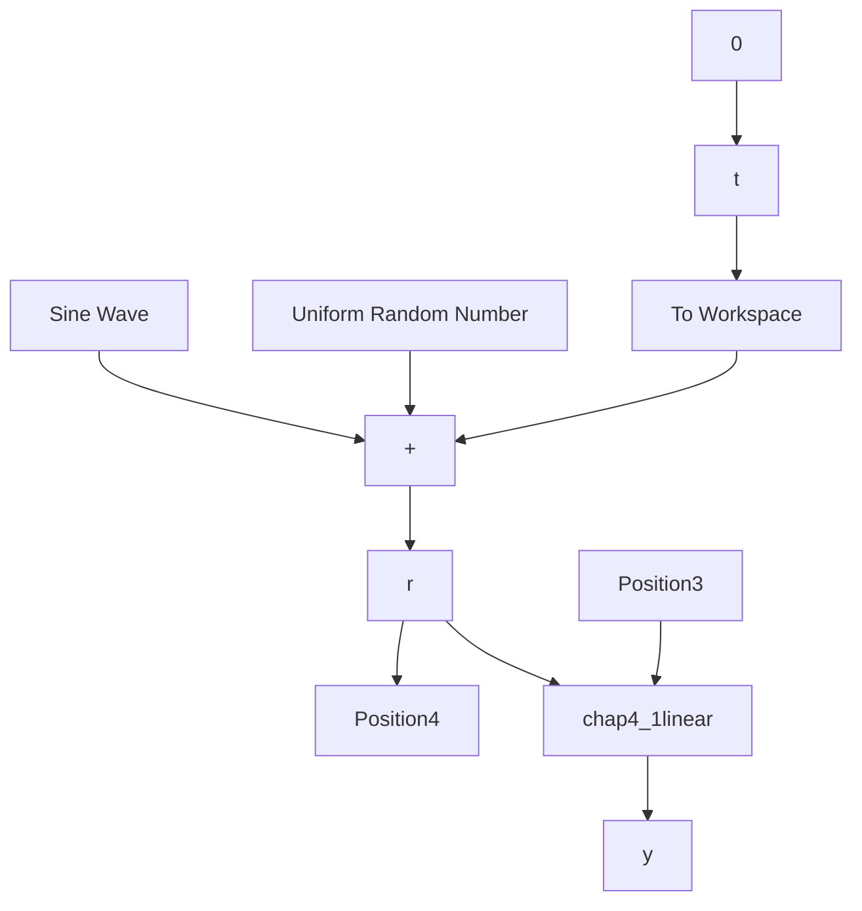

# (1) 微分器信号处理

① 连续系统仿真。

a. 主程序：chap4\_1sim.mdl


<details>
<summary>flowchart</summary>


</details>

b. 微分器 S 函数：chap4\_1linear.m

```matlab
function [sys,x0,str,ts] = Differentiator(t,x,u,flag)
switch flag,
case 0, 
```

```matlab
[sys,x0,str,ts]=mdlInitializeSizes;
case 1,
    sys=mdlDerivatives(t,x,u);
case 3,
    sys=mdlOutputs(t,x,u);
case {2,4,9}
    sys = [];
otherwise
    error(['Unhandled flag = ',num2str(flag)]);
end
function [sys,x0,str,ts]=mdlInitializeSizes
sizes = simsizes;
sizes.NumContStates = 2;
sizes.NumDiscStates = 0;
sizes.NumOutputs = 2;
sizes.NumInputs = 1;
sizes.DirFeedthrough = 1;
sizes.NumSampleTimes = 1;
sys = simsizes(sizes);
x0 = [0 0];
str = [];
ts = [0 0];
function sys=mdlDerivatives(t,x,u)
vt=u(1);
e=x(1)-vt;
R=1/0.05;a0=0.1;b0=0.1;

sys(1)=x(2);
sys(2)=R^2*(-a0*e-b0*x(2)/R);
function sys=mdlOutputs(t,x,u)
sys = x; 
```

c. 作图程序: chap4\_1plot.m  
```matlab
close all;

figure(1);
subplot(211);
plot(t,sin(t),'r',t,r,'k:','linewidth',2);
xlabel('time(s)');ylabel('signal');
legend('ideal signal','signal with noise');
subplot(212);
plot(t,sin(t),'r',t,y(:,1),'k:','linewidth',2);
xlabel('time(s)');ylabel('signal');
legend('ideal signal','signal by TD');

figure(2);
plot(t,cos(t),'r',t,y(:,2),'k:','linewidth',2);
xlabel('time(s)');ylabel('derivative signal');
legend('ideal derivative signal','derivative signal by TD'); 
```

② 数字仿真。

离散微分器程序：chap4\_2.m

```matlab
close all;
clear all;
T=0.001;
y_1=0;dy_1=0;
yv_1=0;
v_1=0;
for k=1:1:6000
t=k*T;
time(k)=t;

v(k)=sin(t);
dv(k)=cos(t);

d(k)=0.01*rands(1); %Noise
yv(k)=v(k)+d(k); %Practical signal

R=1/0.01;a0=0.1;b0=0.1;
y(k)=y_1+T*dy_1;
dy(k)=dy_1+T*R^2*(-a0*(y(k)-yv(k))-b0*dy_1/R);

dyv(k)=(yv(k)-yv_1)/T; %Speed by Difference

y_1=y(k);
v_1=v(k);
yv_1=yv(k);
dy_1=dy(k);
end
