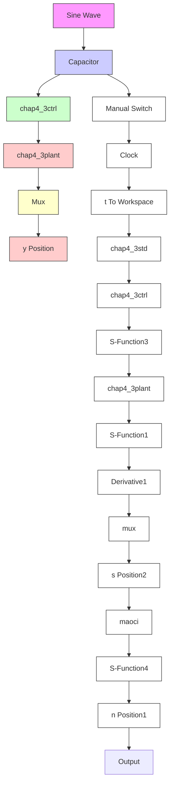

# ① 连续系统仿真。

a. 主程序：chap4\_3sim.mdl


<details>
<summary>flowchart</summary>


</details>

b. 控制器 S 函数：chap4\_3ctrl.m

```matlab
function [sys,x0,str,ts] = Differentiator(t,x,u,flag)
switch flag,
case 0,
    [sys,x0,str,ts]=mdlInitializeSizes;
case 3,
    sys=mdlOutputs(t,x,u);
case {1,2,4,9}
    sys = [];
otherwise
    error(['Unhandled flag = ',num2str(flag)]);
end
function [sys,x0,str,ts]=mdlInitializeSizes
sizes = simsizes;
sizes.NumDiscStates = 0;
sizes.NumOutputs = 1;
sizes.NumInputs = 3;
sizes.DirFeedthrough = 1;
sizes.NumSampleTimes = 1;
sys = simsizes(sizes);
x0 = [];
str = [];
ts = [0 0];
function sys=mdlOutputs(t,x,u)
yd=u(1);
dyd=cos(t);
y=u(2);
dy=u(3);
e=yd-y;
de=dyd-dy; 
```

```javascript
kp=10;kd=0.5;
ut=kp*e+kd*de;
sys(1)=ut; 
```
