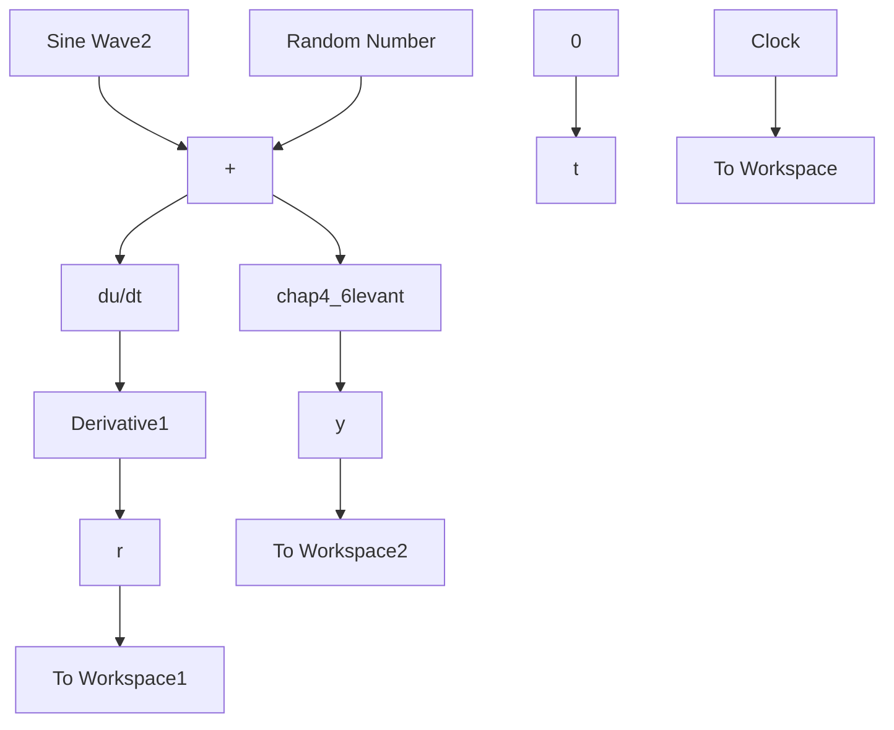

# (1) 微分器扫频分析

① 扫频测试程序：chap4\_5a.m

```matlab
clear all;
close all;

T=0.001;
Am=1;

f=1;
for F=0.1:0.5:30
u_1=0;y_1=0;dy_1=0;
for k=1:1:10000
time(k)=k*T;
u(f,k)=Am*sin(1*2*pi*F*k*T); % Sine Signal with different frequency

%Levant TD
afa=15;nbd=10; %From Levant paper 
```

```matlab
afa=15;nbd=20; %From Levant paper
y(f,k)=y_1+T*(dy_1-nbd*sqrt(abs(y_1-u(f,k)))*sign(y_1-u(f,k)));
dy(k)=dy_1-T*afa*sign(y_1-u(f,k));
dy_1=dy(k);

uk(k)=u(f,k);
yk(k)=y(f,k);

y_1=yk(k);
u_1=uk(k);
end
f=f+1;
end

save TDfile y; 
```

② 微分器频域特性分析程序：chap4\_5b.m

```matlab
close all;
clear all;
T=0.001;
Am=1;

load TDfile;
kk=0;
f=1;
for F=0.1:0.5:30
kk=kk+1;
FF(kk)=F;
w=FF*2*pi; % in rad./s

for i=5001:1:10000
    fai(1,i-5000)=sin(2*pi*F*i*T);
    fai(2,i-5000)=cos(2*pi*F*i*T);
end

Fai=fai';

fai_in(kk)=0;

Y_out=y(f,5001:1:10000)';
cout=inv(Fai'*Fai)*Fai'*Y_out;
fai_out(kk)=atan(cout(2)/cout(1)); % Phase Frequency(Deg.)

Af(kk)=sqrt(cout(1)^2+cout(2)^2); % Magnitude Frequency(dB)
mag_e(kk)=20*log10(Af(kk)/Am); % in dB
ph_e(kk)=(fai_out(kk)-fai_in(kk))*180/pi; % in Deg.

f=f+1;
end 
```

```matlab
figure(1);
hold on;
subplot(2,1,1);
semilogx(w,mag_e,'r-','linewidth',2);grid on;
xlabel('rad./s');ylabel('Mag.(dB.)');
hold on;
subplot(2,1,2);
semilogx(w,ph_e,'r-','linewidth',2);grid on;
xlabel('rad./s');ylabel('Phase(Deg.)'); 
```

(2) 微分器信号处理: 分连续系统和离散系统两种情况。

① 连续系统仿真。

a. Simulink 仿真主程序: chap4\_6sim.mdl


<details>
<summary>flowchart</summary>


</details>

b. 微分器 S 函数：chap4\_6levant.m
