figure(2);
plot(time,du,'r',time,dy,'k:','linewidth',2);
xlabel('time(s)'),ylabel('derivative estimation');
legend('cos(t)',x2 by Levant differentiator'); 
```

（3）基于微分器的 PID 控制：分连续系统和离散系统两种情况

① 连续系统仿真。

a. Simulink 仿真主程序: chap4\_8sim.mdl

```mermaid
graph TD
    A["Sine Wave"] --> B["chap4_6ctrl"]
    B --> C["chap4_6plant"]
    C --> D["Mux"]
    D --> E["y Position"]
    E --> F["+"]
    F --> G["chap4_8maoci"]
    G --> H["n Position1"]
    H --> I["s Function4"]
    I --> J["mux"]
    J --> K["s Function2"]
    K --> L["Mux"]
    L --> M["chap4_Blevant"]
    M --> N["du/dt Derivative1"]
    N --> O["Mux"]
    O --> P["chap4_6ctrl"]
    P --> Q["S-Function3"]
    Q --> R["Mux"]
    R --> S["chap4_6plant"]
    S --> T["S-Function1"]
    T --> U["Mux"]
    U --> V["y Position"]
    V --> W["+"]
    W --> X["chap4_Blevant"]
    X --> Y["S-Function5"]
    Y --> Z["Mux"]
    Z --> AA["s Function4"]
    AA --> AB["n Position1"]
    AB --> AC["chap4_8maoci"]
    AC --> AD["+"]
    AD --> AE["chap4_Blevant"]
    AE --> AF["S-Function3"]
    AF --> AG["Mux"]
    AG --> AH["s Function2"]
    AH --> AI["Mux"]
    AI --> AJ["chap4_Blevant"]
    AJ --> AK["S-Function1"]
    AK --> AL["Mux"]
    AL --> AM["y Position"]
    AM --> AN["+"]
    AN --> AO["chap4_Blevant"]
    AO --> AP["S-Function5"]
    AP --> AQ["Mux"]
    AQ --> AR["s Function4"]
    AR --> AS["n Position1"]
    AS --> AT["chap4_Blevant"]
    AT --> AU["S-Function3"]
    AU --> AV["Mux"]
    AV --> AW["du/dt Derivative1"]
    AW --> AX["Mux"]
    AX --> AY["chap4_Blevant"]
    AY --> AZ["S-Function5"]
    AZ --> BA["Mux"]
    BA --> BB["s Function2"]
    BB --> BC["n Position1"]
    BC --> BD["chap4_Blevant"]
    BD --> BE["S-Function3"]
    BE --> BF["Mux"]
    BF --> BG["y Position"]
```


<details>
<summary>flowchart</summary>


</details>

基于微分器的 PD 控制主程序
