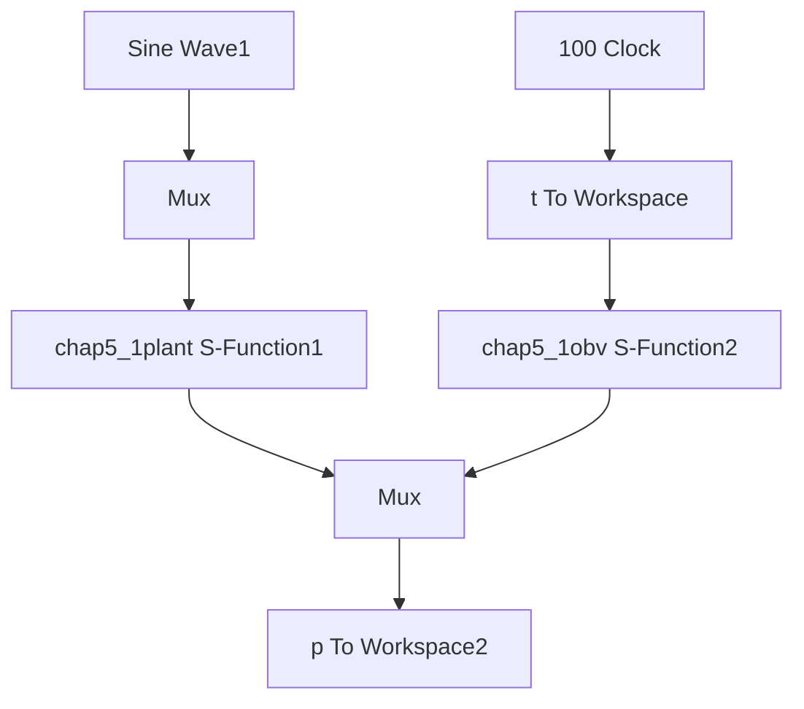

# (1) 观测器仿真程序

① Simulink 主程序：chap5\_1sim.mdl


<details>
<summary>flowchart</summary>


</details>

观测器开环测试主程序

② 观测器 S 函数：chap5\_1obv.m

```matlab
function [sys,x0,str,ts]=s_function(t,x,u,flag)
switch flag,
case 0,
    [sys,x0,str,ts]=mdlInitializeSizes;
case 1,
    sys=mdlDerivatives(t,x,u);
case 3,
    sys=mdlOutputs(t,x,u);
case {2,4,9}
    sys = [];
otherwise
    error(['Unhandled flag = ',num2str(flag)]);
end 
```

```matlab
function [sys,x0,str,ts]=mdlInitializeSizes
sizes = simsizes;
sizes.NumContStates = 2;
sizes.NumDiscStates = 0;
sizes.NumOutputs = 2;
sizes.NumInputs = 4;
sizes.DirFeedthrough = 0;
sizes.NumSampleTimes = 0;
sys=simsizes(sizes);
x0=[0;0];
str=[];
ts=[];
function sys=mdlDerivatives(t,x,u)
ut=u(1);
dth=u(3);

k1=1000;
k2=200;

a=5;b=0.15;
sys(1)=k1*(x(2)-dth);
sys(2)=-x(1)+a*ut-k2*(x(2)-dth)-b*dth;
function sys=mdlOutputs(t,x,u)
sys(1)=x(1); %d estimate
sys(2)=x(2); %speed estimate 
```

③ 被控对象 S 函数：chap5\_1plant.m  
```matlab
function [sys,x0,str,ts]=s_function(t,x,u,flag)
switch flag,
case 0,
    [sys,x0,str,ts]=mdlInitializeSizes;
case 1,
    sys=mdlDerivatives(t,x,u);
case 3,
    sys=mdlOutputs(t,x,u);
case {2,4,9}
    sys = [];
otherwise
    error(['Unhandled flag = ',num2str(flag)]);
end
function [sys,x0,str,ts]=mdlInitializeSizes
sizes = simsizes;
sizes.NumContStates = 2;
sizes.NumDiscStates = 0;
sizes.NumOutputs = 3;
sizes.NumInputs = 1;
sizes.DirFeedthrough = 0;
sizes.NumSampleTimes = 0;
sys=simsizes(sizes); 
```

```matlab
x0=[0;0];
str=[];
ts=[];
function sys=mdlDerivatives(t,x,u)
ut=u(1);
b=0.15;
a=5;
d=150*sign(sin(0.1*t));
ddth=-b*x(2)+a*ut-d;
sys(1)=x(2);
sys(2)=ddth;
function sys=mdlOutputs(t,x,u)
d=150*sign(sin(0.1*t));
sys(1)=x(1);
sys(2)=x(2);
sys(3)=d; 
```

④ 作图程序：chap5\_1plot.m

```matlab
close all;
figure(1);
plot(t,p(:,3),'r',t,p(:,4),'b:','linewidth',2);
xlabel('time(s)');ylabel('d and its estimate');
legend('d','Estimate d'); 
```

(2) PD 控制仿真程序

① Simulink 主程序：chap5\_2sim.mdl
