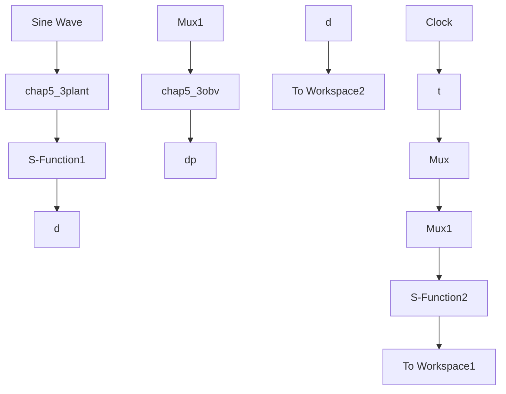

# 〖仿真程序〗

(1) 仿真实例 1: 观测器仿真程序

① Simulink 主程序：chap5\_3sim.mdl


<details>
<summary>flowchart</summary>


</details>

② 被控对象程序：chap5\_3plant.m

```matlab
function [sys,x0,str,ts]=NDO_plant(t,x,u,flag)
switch flag,
case 0,
    [sys,x0,str,ts]=mdlInitializeSizes;
case 1,
    sys=mdlDerivatives(t,x,u);
case 3,
    sys=mdlOutputs(t,x,u);
case {2,4,9}
    sys = [];
otherwise
    error(['Unhandled flag = ',num2str(flag)]);
end
function [sys,x0,str,ts]=mdlInitializeSizes
sizes = simsizes;
sizes.NumContStates = 2;
sizes.NumDiscStates = 0;
sizes.NumOutputs = 3;
sizes.NumInputs = 1;
sizes.DirFeedthrough = 1;
sizes.NumSampleTimes = 0;
sys=simsizes(sizes);
x0=[0.1,0];
str=[];
ts=[];
function sys=mdlDerivatives(t,x,u)
ut=u(1);
%dt=-5;
dt=0.05*sin(t);
sys(1)=x(2);
sys(2)=-25*x(2)+133*(ut+dt);
function sys=mdlOutputs(t,x,u) 
```

```matlab
%dt=-5;
dt=0.05*sin(t);
sys(1)=x(1);
sys(2)=x(2);
sys(3)=dt; 
```

③ 干扰观测器程序：chap5\_3obv.m   
```matlab
function [sys,x0,str,ts]=NDO(t,x,u,flag)
switch flag,
case 0,
    [sys,x0,str,ts]=mdlInitializeSizes;
case 1,
    sys=mdlDerivatives(t,x,u);
case 3,
    sys=mdlOutputs(t,x,u);
case {2,4,9}
    sys = [];
otherwise
    error(['Unhandled flag = ',num2str(flag)]);
end
function [sys,x0,str,ts]=mdlInitializeSizes
sizes = simsizes;
sizes.NumContStates = 1;
sizes.NumDiscStates = 0;
sizes.NumOutputs = 1;
sizes.NumInputs = 4;
sizes.DirFeedthrough = 1;
sizes.NumSampleTimes = 0;
sys=simsizes(sizes);
x0=[0];
str=[];
ts=[];
function sys=mdlDerivatives(t,x,u)
K=50;
J=1/133;
b=25/133;

ut=u(1);

dth=u(3);
z=x(1);
dp=z+K*J*dth;

dz=K*(b*dth-ut)-K*dp;
sys(1)=dz;
function sys=mdlOutputs(t,x,u)
K=50;
J=1/133;
dth=u(3); 
```

$z=x(1);$ $dp=z+K^{*}J^{*}dth;$ sys(1)=dp;

④ 作图程序：chap5\_3plot.m

```matlab
close all;
