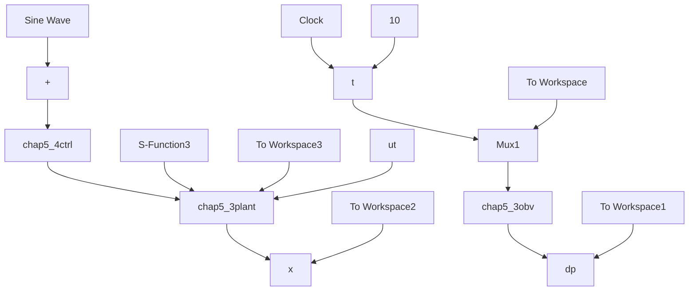

figure(1);
subplot(211);
plot(t,d(:,3),'r',t,dp(:,1),'-.b','linewidth',2);
xlabel('time(s)');ylabel('dt and its estimation');
legend('dt','dt estiamtion');
subplot(212);
plot(t,d(:,3)-dp(:,1),'r','linewidth',2);
xlabel('time(s)');ylabel('error between dt and its estimation'); 
```

(2) 仿真实例 2: 控制系统仿真程序

① Simulink 主程序：chap5\_4sim.mdl


<details>
<summary>flowchart</summary>


</details>

Simulink 主程序

② 被控对象程序：chap5\_3plant.m（见仿真实例1的仿真程序）  
③ 控制器程序：chap5\_4ctrl.m

```matlab
function [sys,x0,str,ts]=s_function(t,x,u,flag)
switch flag,
case 0,
    [sys,x0,str,ts]=mdlInitializeSizes;
case 3,
    sys=mdlOutputs(t,x,u);
case {1,2,4,9}
    sys = [];
otherwise
    error(['Unhandled flag = ',num2str(flag)]);
end
function [sys,x0,str,ts]=mdlInitializeSizes 
```

```matlab
sizes = simsizes;
sizes.NumContStates = 0;
sizes.NumDiscStates = 0;
sizes.NumOutputs = 1;
sizes.NumInputs = 5;
sizes.DirFeedthrough = 1;
sizes.NumSampleTimes = 1;
sys=simsizes(sizes);
x0=[];
str=[];
ts=[-1 0];
function sys=mdlOutputs(t,x,u)
J=1/133;b=25/133;

thd=u(1);
dthd=cos(t);
ddthd=-sin(t);

th=u(2);
dth=u(3);
dp=u(5);

e=thd-th;
de=dthd-dth;
kp=10;kd=1.0;

ut=kp*e+kd*de+J*ddthd+b*dthd-dp;
sys(1)=ut; 
```

④ 干扰观测器程序：chap5\_3obv.m（见“仿真实例1”的仿真程序）  
⑤ 作图程序：chap5\_4plot.m

```matlab
close all;
figure(1);
subplot(211);
plot(t,sin(t),'r',t,x(:,1),'-.b','linewidth',2);
xlabel('time(s)');ylabel('x1 tracking');
legend('ideal angle','x1');
subplot(212);
plot(t,cos(t),'r',t,x(:,2),'-.b','linewidth',2);
xlabel('time(s)');ylabel('x2 tracking');
legend('ideal angle speed','x2');
figure(2);
subplot(211);
plot(t,x(:,3),'r',t,dp(:,1),'-.b','linewidth',2);
xlabel('time(s)');ylabel('dt and its estimation');
legend('dt','dt estiamtion');
subplot(212); 
```

```matlab
plot(t,x(:,3)-dp(:,1),'r','linewidth',2);
xlabel('time(s)');ylabel('error between dt and its estimation');
figure(3);
plot(t,ut(:,1),'r','linewidth',2);
xlabel('time(s)');ylabel('Control input'); 
```


