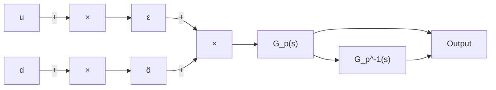
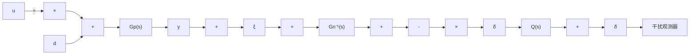
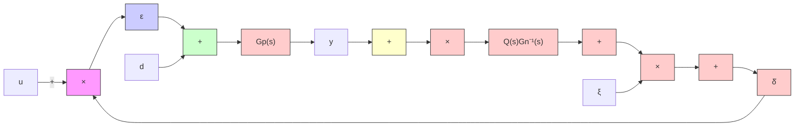

# 5.3.1 干扰观测器基本原理

干扰观测器的基本思想是将外部力矩干扰及模型参数变化造成的实际对象与名义模型输出的差异，统统等效地控制输入端，即观测出等效干扰，在控制中引入等量的补偿，实现

对干扰完全抑制。干扰观测器的基本思想如图 5-9 所示 $^{[3]}$ 。

图 5-9 中的 $G_{\mathrm{p}}(s)$ 为对象的传递函数，d 为等效干扰， $\hat{d}$ 为观测干扰，u 为控制输入。由图 5-9，求出等效干扰的估计值 $\hat{d}$ 为

$$\hat {d} = \left(\varepsilon + d\right) G _ {\mathrm{p}} (s) G _ {\mathrm{p}} ^ {- 1} (s) - \varepsilon = d \tag {5.15}$$

flowchart

图 5-9 干扰观测器的基本思想

式（5.15）说明，用上述方法可以实现对干扰的准确估计。

但对于实际的物理系统，观测器式（5.15）的实现存在如下问题：

（1）通常情况下， $G_{\mathrm{p}}(s)$ 的相对阶不为 0，其逆物理上不可实现；  
(2) 对象 $G_{\mathrm{p}}(s)$ 的精确数学模型无法得到;  
（3）考虑测量噪声的影响，上述方法的观测精度将下降。

解决上述问题的一个自然的想法是在 $\hat{d}$ 的后面串入低通滤波器 $Q(s)$ ，并用名义模型 $G_{\mathrm{n}}(s)$ 的逆 $G_{\mathrm{n}}^{-1}(s)$ 来替代 $G_{\mathrm{p}}^{-1}(s)$ ，得到如图 5-10 所示的框图，其中虚线框内部分为干扰观测器， $\xi$ 为测量噪声，u、d、 $\xi$ 为输入信号。图 5-10 的干扰观测器等效框图如图 5-11 所示。

flowchart

图 5-10 干扰观测器原理框图

flowchart

图 5-11 干扰观测器等效框图

