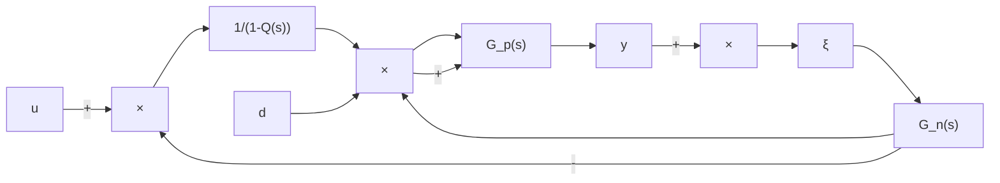

# 5.3.2 干扰观测器的性能分析

根据梅森公式，传递函数可由下式求得

$$G (s) = \frac {\sum_ {k = 1} ^ {n} P _ {k} \Delta_ {k}}{\Delta} \tag {5.16}$$

式中， $\sum_{k=1}^{n}P_{k}\Delta_{k}$ 和 $\Delta$ 的含义及求取表达式见本节最后的“知识点”。

由图 5-11 可求得

$$\sum_ {k = 1} ^ {n} P _ {k} \Delta_ {k} = G _ {\mathrm{p}} (s), \quad \sum L _ {i} = Q (s) - G _ {\mathrm{n}} ^ {- 1} (s) Q (s) G _ {\mathrm{p}} (s)$$

从而可得到从 $u$ 到 $y$ 的传递函数

$$
\begin{array}{l} G _ {u y} (s) = \frac {G _ {\mathrm{p}} (s)}{1 - \left[ Q (s) - G _ {\mathrm{n}} ^ {- 1} (s) Q (s) G _ {\mathrm{p}} (s) \right]} = \frac {G _ {\mathrm{p}} (s) G _ {\mathrm{n}} (s)}{Q (s) G _ {\mathrm{p}} (s) + G _ {\mathrm{n}} (s) [ 1 - Q (s) ]} \\ = \frac {\frac {G _ {\mathrm{p}} (s)}{1 - Q (s)}}{1 + \frac {Q (s)}{G _ {\mathrm{n}} (s)} \frac {G _ {\mathrm{p}} (s)}{1 - Q (s)}} \tag {5.17} \\ \end{array}
$$

即

$$G _ {u y} (s) = \frac {G _ {\mathrm{p}} (s) G _ {\mathrm{n}} (s)}{G _ {\mathrm{n}} (s) + \left[ G _ {\mathrm{p}} (s) - G _ {\mathrm{n}} (s) \right] Q (s)} \tag {5.18}$$

根据式（5.17），对图 5-10 做等效变换，可得到干扰观测器原理的简化框图，如图 5-12 所示。

flowchart

图 5-12 图 5-10 的等效变换

利用梅森公式，根据图 5-12，可得

$$G _ {d y} (s) = \frac {G _ {\mathrm{p}} (s) G _ {\mathrm{n}} (s) [ 1 - Q (s) ]}{G _ {\mathrm{n}} (s) + [ G _ {\mathrm{p}} (s) - G _ {\mathrm{n}} (s) ] Q (s)} \tag {5.19}G _ {\xi y} (s) = \frac {G _ {\mathrm{p}} (s) Q (s)}{G _ {\mathrm{n}} (s) + \left[ G _ {\mathrm{p}} (s) - G _ {\mathrm{n}} (s) \right] Q (s)} \tag {5.20}$$

$Q(s)$ 是干扰观测器设计中一个非常重要的环节。由图 5-12 可知， $Q(s)$ 的设计必须满足 $Q(s)G_{n}^{-1}(s)$ 为正则，即 $Q(s)$ 的相对阶应不小于 $G_{n}(s)$ 的相对阶；其次， $Q(s)$ 带宽的设计，必须同时满足干扰观测器的鲁棒稳定性和干扰抑制能力。

$Q(s)$ 的设计原则：在低频段， $Q(s)=1$ ；在高频段， $Q(s)=0$ 。具体分析如下。

（1）在低频时， $Q(s)=1$ ，由式（5.17）～式（5.19），有

$$G _ {u y} (s) = G _ {\mathrm{n}} (s), \quad G _ {d y} (s) = 0, \quad G _ {\xi y} (s) = 1 \tag {5.21}$$

上式说明，在低频段，干扰观测器仍使得实际对象的响应与名义模型的响应一致，即可以实现对低频干扰的有效观测，从而保证较好的鲁棒性。 $G_{dy}(s)=0$ 说明干扰观测器对于 $Q(s)$ 频带内的低频干扰具有完全的抑制能力， $G_{\xi y}(s)=1$ 说明干扰观测器对于低频测量噪声非常敏感，因此，在实际应用中，必须考虑采取适当的措施，减小运动状态测量中的低频噪声。

（2）在高频段， $Q(s)=0$ ，由式（5.18）～式（5.20），有

$$G _ {u y} (s) = G _ {\mathrm{p}} (s), \quad G _ {d y} (s) = G _ {\mathrm{p}} (s), \quad G _ {\xi y} (s) = 0 \tag {5.22}$$

上式说明，在高频时，干扰观测器对测量噪声不敏感，可以实现对高频噪声的有效滤除，但对于对象参数的摄动及外部扰动没有任何抑制作用。

通过上述分析可见，通过采用低通滤波器设计 $Q(s)$ ，可以实现对低频干扰的有效观测和高频噪声的有效滤除，是一种很有效的工程设计方法。

由简化框图 5-12 可以从另一个角度来理解干扰观测器的作用。在低频段， $Q(s)=1$ ，则 $\frac{1}{1-Q(s)}=\infty$ ， $\frac{Q(s)}{G_{n}(s)}=G_{n}^{-1}(s)$ ，显然，加入干扰观测器后，系统在低频段时的控制相当于高增益控制；在高频段， $Q(s)=0$ ，则 $\frac{1}{1-Q(s)}=1$ ， $\frac{Q(s)}{G_{n}(s)}=0$ ，即前向通道的控制增益为 1，反馈系数为 0，则从 u 到 y 之间相当于开环，其传递函数等于对象的开环传递函数 $G_{p}(s)$ ，干扰观测器的作用消失。

