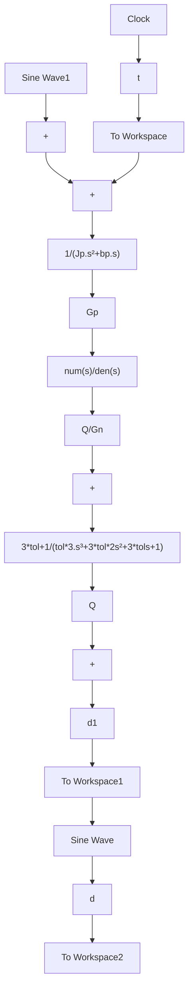

# 〖仿真程序〗

(1) $Q(s)$ 的选择程序: chap5\_5Q.m

```matlab
clear all;
close all;

tol=400*10^(-6);

[np,dp]=pade(tol,6);

delay=tf(np,dp);
delta=tf(np,dp)-1;
sys=1/delta;

figure(1);
bode(1/delta,'r',{5,10^5});grid on;

tol1=0.00035;
Q1=tf([3*tol1,1],[tol1^3,3*tol1^2,3*tol1,1]);
hold on;
bode(Q1,'k');

tol3=0.00125;
Q3=tf([3*tol3,1],[tol3^3,3*tol3^2,3*tol3,1]);
hold on;
bode(Q3,'b');

tol4=0.00425;
Q4=tf([3*tol4,1],[tol4^3,3*tol4^2,3*tol4,1]);
hold on;
bode(Q4,'g');
legend('1/Delta','Q1','Q2','Q3'); 
```

(2) 干扰观测器仿真程序

① 初始化程序：chap5\_5int.m

```matlab
clear all;
close all;
Jp=0.0030;bp=0.067;
Jn=0.0033;bn=0.0673;
Gp=tf([1],[Jp,bp,0]); %Practical plant
Gn=tf([1],[Jn,bn,0]); %Nominal plant
tol=0.001;
Q=tf([3*tol,1],[tol^3,3*tol^2,3*tol,1]);
bode(Q);
dcgain(Q) 
```

```javascript
QGn=Q/Gn;
[num,den]=tfdata(QGn,'v'); 
```

② Simulink 主程序：chap5\_5sim.mdl（干扰观测器开环测试主程序）


<details>
<summary>flowchart</summary>


</details>

③ 作图程序：chap5\_5plot.m

```matlab
close all;
figure(1);
subplot(211);
plot(t,d(:,1),'r',t,d1(:,1),'b:','linewidth',2);
xlabel('time(s)');ylabel('d and its estimate');
legend('d','Estimate d');
subplot(212);
plot(t,d(:,1)-d1(:,1),'r','linewidth',2);
xlabel('t/s');ylabel('d identification error'); 
```

(3) 基于干扰观测器的 PD 控制仿真程序

① 初始化程序：chap5\_6int.m

```matlab
clear all;
close all;
Jp=0.0030;bp=0.067;
Jn=0.0033;bn=0.0673;
Gp=tf([1],[Jp,bp,0]); %Practical plant
Gn=tf([1],[Jn,bn,0]); %Nominal plant
tol=0.001;
Q=tf([3*tol,1],[tol^3,3*tol^2,3*tol,1]);
bode(Q);
dcgain(Q)
OD1=1/(1-Q);
OD2=Q/Gn;
OD3 = Q*Gn;
[num,den]=tfdata(OD2,'v');
[num1,den1]=tfdata(OD1,'v'); 
```

```javascript
[num2,den2]=tfdata(OD3,'v'); 
```

② Simulink 主程序：chap5\_6sim.mdl（干扰观测器闭环测试主程序）


<details>
<summary>flowchart</summary>
