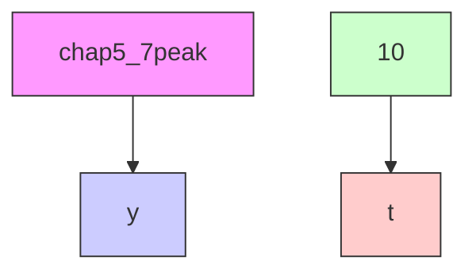
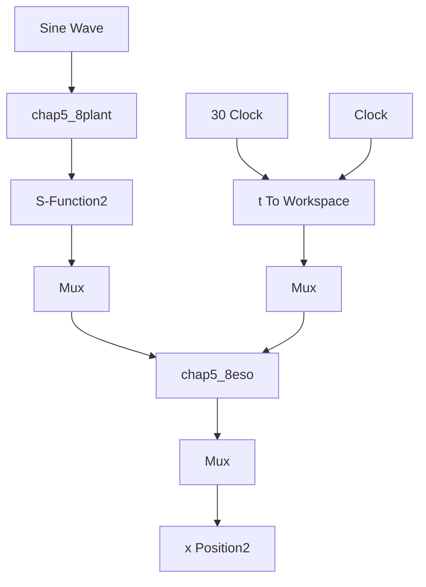

# (1) 峰值抑制

① 主程序：chap5\_7.sim.mdl


<details>
<summary>flowchart</summary>


</details>

② 峰值抑制 S 函数：chap5\_7peak.m

```matlab
function [sys,x0,str,ts]=s_function(t,x,u,flag)
switch flag,
case 0,
    [sys,x0,str,ts]=mdlInitializeSizes;
case 3,
    sys=mdlOutputs(t,x,u);
case {1,2,4,9}
    sys = [];
otherwise
    error(['Unhandled flag = ',num2str(flag)]);
end
function [sys,x0,str,ts]=mdlInitializeSizes
sizes = simsizes;
sizes.NumDiscStates = 0;
sizes.NumOutputs = 2;
sizes.NumInputs = 0;
sizes.DirFeedthrough = 1;
sizes.NumSampleTimes = 1;
sys = simsizes(sizes);
x0 = [];
str = [];
ts = [0 0];
function sys=mdlOutputs(t,x,u)
Lambda=50;
R=100*(1-exp(-Lambda*t))/(1+exp(-Lambda*t));
Epsilon=1/R;
sys(1)=R;
sys(2)=Epsilon; 
```

③ 作图程序：chap5\_7plot.m

```matlab
close all;
figure(1);
subplot(211);
plot(t,y(:,1),'r','linewidth',2);
xlabel('time(s)');ylabel('R change');
subplot(212); 
```

```matlab
plot(t,y(:,2),'r','linewidth',2);
xlabel('time(s)');ylabel('Epsilon change'); 
```

(2) 扩张观测器

① 连续系统仿真。

主程序：chap5\_8sim.mdl


<details>
<summary>flowchart</summary>


</details>

a. 扩张观测器 S 函数: chap5\_8eso.m

```matlab
function [sys,x0,str,ts]=s_function(t,x,u,flag)
switch flag,
case 0,
    [sys,x0,str,ts]=mdlInitializeSizes;
case 1,
    sys=mdlDerivatives(t,x,u);
case 3,
    sys=mdlOutputs(t,x,u);
case {2,4,9}
    sys = [];
otherwise
    error(['Unhandled flag = ',num2str(flag)]);
end
function [sys,x0,str,ts]=mdlInitializeSizes
sizes = simsizes;
sizes.NumContStates = 3;
sizes.NumDiscStates = 0;
sizes.NumOutputs = 3;
sizes.NumInputs = 2;
sizes.DirFeedthrough = 1;
sizes.NumSampleTimes = 0;
sys=simsizes(sizes);
x0=[0 0 0];
str=[];
ts=[];
function sys=mdlDerivatives(t,x,u)
y=u(1);
ut=u(2);

J=10;
b=1/J; 
```
