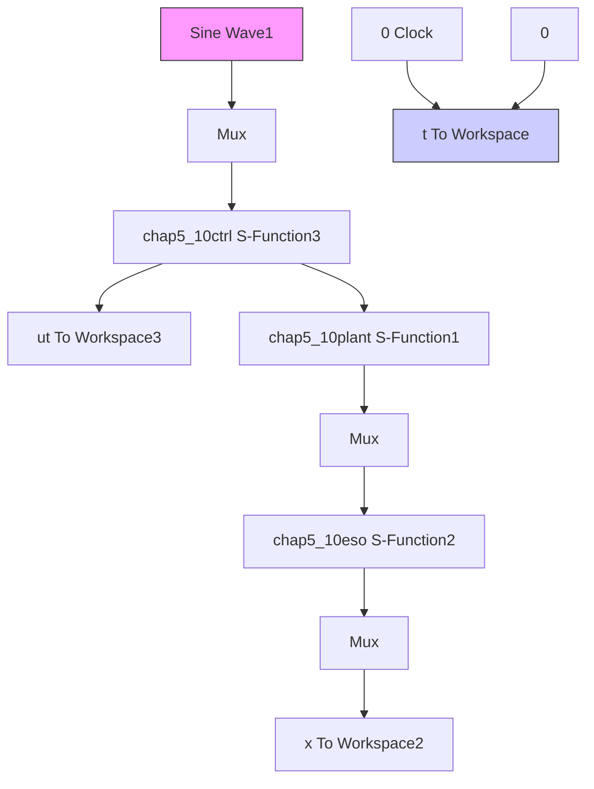

M=3;
if M==1
    epc=0.01;
elseif M==2
    if time(k)<=1;
    R=100*time(k)^3;
    elseif time(k)>1;
    R=100;
    end
    epc=1/R;
elseif M==3
    nmn=1.0;
    R=100*(1-exp(-nmn*time(k))/(1+exp(-nmn*time(k)));
    epc=1/R;
end

%Extended observer
x1p(k)=x1p_1+ts*(x2p_1-h1/epc*(x1p_1-th(k)));
x2p(k)=x2p_1+ts*(x3p_1-h2/epc^2*(x1p_1-th(k))+b*u(k));
x3p(k)=x3p_1+ts*(-h3/epc^3*(x1p_1-th(k)));

fxp(k)=x3p(k);

u_1=u(k);
x1_1=x1(k);
x1p_1=x1p(k);
x2p_1=x2p(k);
x3p_1=x3p(k);
end

figure(1);
subplot(211);
plot(time,th,'k',time,x1p,'r:',linewidth',2);
xlabel('time(s)');ylabel('x1 and x1p'); 
```

```matlab
legend('position signal','position signal estimated');
subplot(212);
plot(time,x2,'k',time,x2p,'r:');
xlabel('time(s)');ylabel('x2 and x2p');
legend('speed signal','speed signal estimated');
figure(2);
plot(time,fx,'k',time,fxp,'r');
xlabel('time(s)');ylabel('f and fp');
legend('uncertain part','uncertain part estimated'); 
```

b. 对象 S 函数: chap5\_9plant.m  
```matlab
function dx=Plant(t,x,flag,para)
dx=zeros(2,1);
J=10;
ut=para(1);
t=para(2);

dt=3.0*sin(t);
dx(1)=x(2);
dx(2)=1/J*(ut-dt); 
```

(3) 基于扩张观测器的 PID 控制

① 连续系统仿真。

a. 主程序：chap5\_10sim.mdl


<details>
<summary>flowchart</summary>


</details>

b. 控制器 S 函数：chap5\_10ctrl.m

```matlab
function [sys,x0,str,ts]=s_function(t,x,u,flag)
switch flag,
case 0,
    [sys,x0,str,ts]=mdlInitializeSizes;
case 1,
    sys=mdlDerivatives(t,x,u);
case 3,
    sys=mdlOutputs(t,x,u);
case {1,2,4,9}
    sys = [];
otherwise 
```

```matlab
error(['Unhandled flag = ',num2str(flag)]);
end
function [sys,x0,str,ts]=mdlInitializeSizes
sizes = simsizes;
sizes.NumContStates = 0;
sizes.NumDiscStates = 0;
sizes.NumOutputs = 1;
sizes.NumInputs = 4;
sizes.DirFeedthrough = 1;
sizes.NumSampleTimes = 0;
sys=simsizes(sizes);
x0=[];
str=[];
ts=[];
function sys=mdlOutputs(t,x,u)
yd=u(1);
dyd=cos(t);
yp=u(2);
dyp=u(3);
fp=u(4);
e=yd-yp;
de=dyd-dyp;
