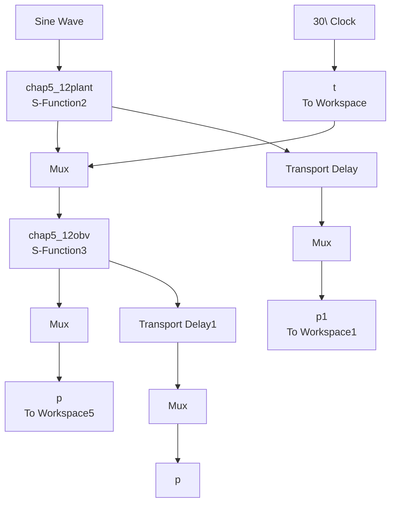

# 〖仿真程序〗

(1) 延迟观测器的验证

① K 的验证主程序: design\_K.m

```matlab
close all;
x0=0;
options=foptions;
options(1)=1;
x=fsolve('fun_x',x0,options) 
```

② K 的验证子程序：fun\_x.m

```matlab
function F=fun(x)
tol=3;
k1=0.1;k2=0.1;
K=[k1,k2]';
C=[1,0];
A=[0 1;-1 -10];
F=det(x*eye(2)-A+K*C*exp(-tol*x));
```

(2) 延迟观测器

① 主程序：chap5\_12sim.mdl


<details>
<summary>flowchart</summary>


</details>

② 对象 S 函数：chap5\_12plant.m

```matlab
function [sys,x0,str,ts]=s_function(t,x,u,flag)
switch flag,
case 0,
[sys,x0,str,ts]=mdlInitializeSizes;
case 1,
sys=mdlDerivatives(t,x,u);
case 3,
sys=mdlOutputs(t,x,u); 
```

```matlab
case {2, 4, 9}
sys = [];
otherwise
error(['Unhandled flag = ',num2str(flag)]);
end
function [sys,x0,str,ts]=mdlInitializeSizes
sizes = simsizes;
sizes.NumContStates = 2;
sizes.NumDiscStates = 0;
sizes.NumOutputs = 2;
sizes.NumInputs =1;
sizes.DirFeedthrough = 1;
sizes.NumSampleTimes = 1;
sys=simsizes(sizes);
x0=[0.2 0];
str=[];
ts=[-1 0];
function sys=mdlDerivatives(t,x,u)
sys(1)=x(2);
sys(2)=-10*x(2)-x(1)+u(1);
function sys=mdlOutputs(t,x,u)
th=x(1);w=x(2);

sys(1)=th;
sys(2)=w; 
```

③ 观测器 S 函数：chap5\_12obv.m  
```matlab
function [sys,x0,str,ts]=s_function(t,x,u,flag)
switch flag,
case 0,
    [sys,x0,str,ts]=mdlInitializeSizes;
case 1,
    sys=mdlDerivatives(t,x,u);
case 3,
    sys=mdlOutputs(t,x,u);
case {2,4,9}
    sys = [];
otherwise
    error(['Unhandled flag = ',num2str(flag)]);
end
function [sys,x0,str,ts]=mdlInitializeSizes
sizes = simsizes;
sizes.NumContStates = 2;
sizes.NumDiscStates = 0;
sizes.NumOutputs = 2;
sizes.NumInputs = 4;
sizes.DirFeedthrough = 0;
sizes.NumSampleTimes = 1;
sys=simsizes(sizes); 
```

```matlab
x0=[0 0];
str=[];
ts=[-1 0];
function sys=mdlDerivatives(t,x,u)
tol=3;
th_tol=u(1);
yp=th_tol;

ut=u(2);

z_tol=[u(3);u(4)];

thp=x(1);wp=x(2);
%%%%
A=[0 1;-1 -10];
C=[1 0];

H=[0;1];
