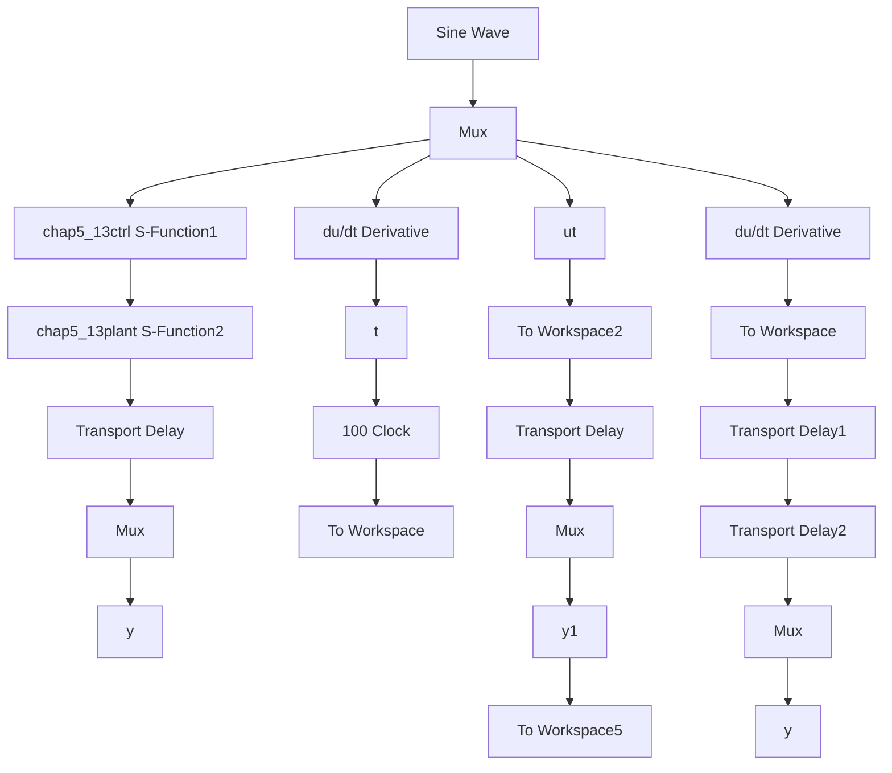

# (3) 控制

① 主程序：chap5\_13sim.mdl


<details>
<summary>flowchart</summary>


</details>

② 控制器 S 函数：chap5\_13ctrl.m

```matlab
function [sys,x0,str,ts]=s_function(t,x,u,flag)
switch flag,
case 0,
    [sys,x0,str,ts]=mdlInitializeSizes;
case 3,
    sys=mdlOutputs(t,x,u);
case {1,2,4,9}
    sys = [];
otherwise
    error(['Unhandled flag = ',num2str(flag)]);
end
function [sys,x0,str,ts]=mdlInitializeSizes
sizes = simsizes;
sizes.NumContStates = 0; 
```

```matlab
sizes.NumDiscStates = 0;
sizes.NumOutputs = 1;
sizes.NumInputs = 5;
sizes.DirFeedthrough = 1;
sizes.NumSampleTimes = 1;
sys=simsizes(sizes);
x0=[];
str=[];
ts=[-1 0];
function sys=mdlOutputs(t,x,u)
tol=3;
thd=sin(t);
wd=cos(t);
ddthd=-sin(t);

thp=u(2);
wp=u(3);
th_tol=u(4);
w_tol=u(5);

%Error with obv
e1p=thd-thp;
e2p=wd-wp;

%Practical error
e1=thd-th_tol;
e2=wd-w_tol;

kp=100;kd=10;

M=1;
if M==1
    ut=kp*e1p+kd*e2p; %With delay observer
elseif M==2
    ut=kp*e1+kd*e2; %Without delay observer
end
sys(1)=ut; 
```

③ 对象 S 函数：chap5\_13plant.m  
```matlab
function [sys,x0,str,ts]=s_function(t,x,u,flag)
switch flag,
case 0,
    [sys,x0,str,ts]=mdlInitializeSizes;
case 1,
    sys=mdlDerivatives(t,x,u);
case 3,
    sys=mdlOutputs(t,x,u);
case {2,4,9}
    sys = []; 
```

```matlab
otherwise
    error(['Unhandled flag = ',num2str(flag)]);
end
function [sys,x0,str,ts]=mdlInitializeSizes
sizes = simsizes;
sizes.NumContStates = 2;
sizes.NumDiscStates = 0;
sizes.NumOutputs = 2;
sizes.NumInputs =1;
sizes.DirFeedthrough = 1;
sizes.NumSampleTimes = 1;
sys=simsizes(sizes);
x0=[0.2 0];
str=[];
ts=[-1 0];
function sys=mdlDerivatives(t,x,u)
sys(1)=x(2);
sys(2)=-10*x(2)-x(1)+u(1);
function sys=mdlOutputs(t,x,u)
th=x(1);w=x(2);

sys(1)=th;
sys(2)=w; 
```

④ 观测器 S 函数：chap5\_13obv.m
