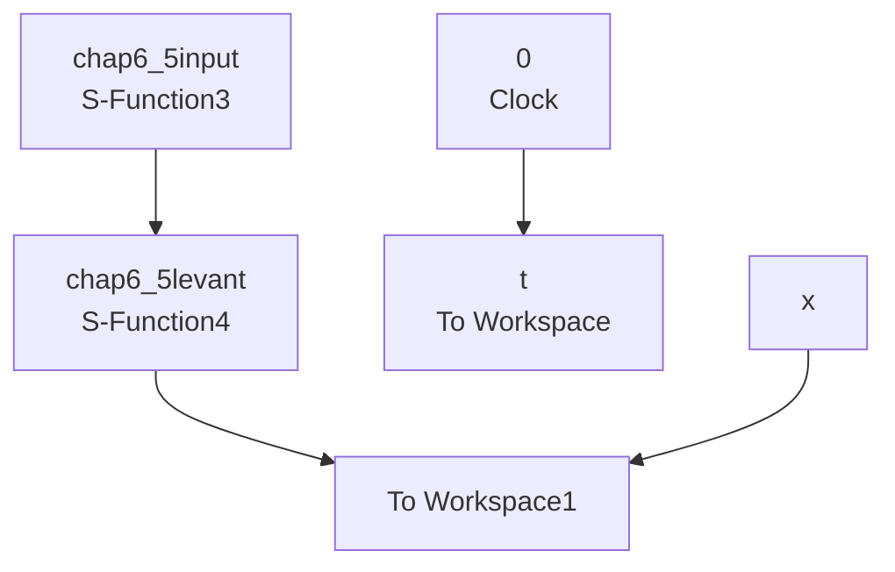

```matlab
figure(1);
subplot(211);
plot(time,r,'k',time,r1,'r','linewidth',2);
legend('Ideal position signal','Transient position signal');
xlabel('time(s)'),ylabel('position signal');
subplot(212);
plot(time,r2,'r','linewidth',2);
legend('Transient speed signal');
xlabel('time(s)'),ylabel('speed signal');
figure(2);
plot(time,r1,'r',time,y,'b','linewidth',2);
legend('Transient position signal','Position signal tracking');
xlabel('time(s)'),ylabel('r,r1,y');
end 
```

② 被控对象程序：chap6\_4plant.m

```matlab
function dy = PlantModel(t,y,flag,p1,p2)
ut=p1;
time=p2;
dy=zeros(3,1);
dy(1)=y(2);
dy(2)=y(3);
dy(3)=-87.35*y(3)-10470*y(2)+523500*ut; 
```

（3）连续系统仿真：采用 Levant 跟踪微分器实现安排过渡过程

① 主程序：chap6\_5sim.mdl


<details>
<summary>flowchart</summary>


</details>

② 输入指令程序：chap6\_5input.m

```matlab
function [sys,x0,str,ts] = input(t,x,u,flag)
switch flag,
case 0,
    [sys,x0,str,ts]=mdlInitializeSizes;
case 3,
    sys=mdlOutputs(t,x,u);
case {2,4,9}
    sys=[];
otherwise
    error(['Unhandled flag = ',num2str(flag)]);
end 
```

```matlab
function [sys,x0,str,ts]=mdlInitializeSizes
sizes = simsizes;
sizes.NumOutputs = 1;
sizes.NumInputs = 0;
sizes.DirFeedthrough = 0;
sizes.NumSampleTimes = 0;
sys = simsizes(sizes);
x0 = [];
str = [];
ts = [];
function sys=mdlOutputs(t,x,u)
yd=1.0*sign(sin(t));
sys(1)=yd; 
```

③ 安排过渡过程程序：chap6\_5levant.m  
```matlab
function [sys,x0,str,ts] = Differentiator(t,x,u,flag)
switch flag,
case 0,
    [sys,x0,str,ts]=mdlInitializeSizes;
case 1,
    sys=mdlDerivatives(t,x,u);
case 3,
    sys=mdlOutputs(t,x,u);
case {2,4,9}
    sys = [];
otherwise
    error(['Unhandled flag = ',num2str(flag)]);
end
function [sys,x0,str,ts]=mdlInitializeSizes
sizes = simsizes;
sizes.NumContStates = 2;
sizes.NumDiscStates = 0;
sizes.NumOutputs = 2;
sizes.NumInputs = 1;
sizes.DirFeedthrough = 1;
sizes.NumSampleTimes = 1;
sys = simsizes(sizes);
x0 = [0 0];
str = [];
ts = [0 0];
function sys=mdlDerivatives(t,x,u)
vt=u(1);
e=x(1)-vt;
alfa=1;
nmn=5;

sys(1)=x(2)-nmn*(abs(e))^0.5*sign(e);
sys(2)=-alfa*sign(e);
function sys=mdlOutputs(t,x,u) 
```

```txt
sys = x; 
```

④ 作图程序：chap6\_5plot.m

```matlab
close all;
figure(1);
subplot(211);
plot(t,x(:,1),'r',t,x(:,2),'k:','linewidth',2);
xlabel('time(s)'),ylabel('position signal');
legend('ideal position signal', 'transient position signal');
subplot(212);
plot(t,x(:,3),'r','linewidth',2);
xlabel('time(s)'),ylabel('speed signal');
legend('transient speed signal'); 
```


