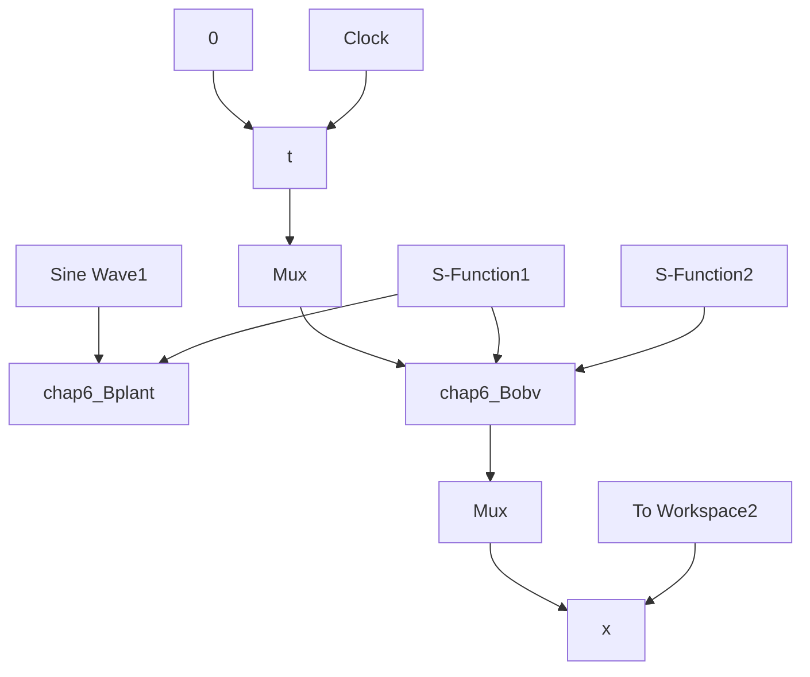

# (1) 连续系统仿真

① 主程序：chap6\_6sim.mdl


<details>
<summary>flowchart</summary>


</details>

② 观测器程序：chap6\_6obv.m  
```matlab
function [sys,x0,str,ts]=s_function(t,x,u,flag)
switch flag,
case 0,
    [sys,x0,str,ts]=mdlInitializeSizes;
case 1,
    sys=mdlDerivatives(t,x,u);
case 3,
    sys=mdlOutputs(t,x,u);
case {2,4,9}
    sys = [];
otherwise
    error(['Unhandled flag = ',num2str(flag)]);
end

function [sys,x0,str,ts]=mdlInitializeSizes
sizes = simsizes;
sizes.NumContStates = 3;
sizes.NumDiscStates = 0;
sizes.NumOutputs = 3;
sizes.NumInputs = 4;
sizes.DirFeedthrough = 0;
sizes.NumSampleTimes = 0;
sys=simsizes(sizes);
x0=[0 0 0];
str=[];
ts=[];
function sys=mdlDerivatives(t,x,u)
ut=u(1);
th=u(2);
b=133;

e=x(1)-th;
beta1=100;beta2=300;beta3=1000;
delta=0.01;
alfa1=0.5;alfa2=0.25;

if abs(e)>delta
    fall=abs(e)^alfa1*sign(e);
else
    fall=e/(delta^(1-alfa1));
end

if abs(e)>delta
    fal2=abs(e)^alfa2*sign(e);
else
    fal2=e/(delta^(1-alfa2));
end

sys(1)=x(2)-beta1*e;
sys(2)=x(3)-beta2*fall+b*ut; 
```

```matlab
sys(3)=-beta3*fal2;
function sys=mdlOutputs(t,x,u)
fp=x(3);
sys(1)=x(1);
sys(2)=x(2);
sys(3)=fp; 
```

③ 被控对象：chap6\_6plant.m  
```matlab
function [sys,x0,str,ts]=s_function(t,x,u,flag)
switch flag,
case 0,
    [sys,x0,str,ts]=mdlInitializeSizes;
case 1,
    sys=mdlDerivatives(t,x,u);
case 3,
    sys=mdlOutputs(t,x,u);
case {2,4,9}
    sys = [];
otherwise
    error(['Unhandled flag = ',num2str(flag)]);
end
function [sys,x0,str,ts]=mdlInitializeSizes
sizes = simsizes;
sizes.NumContStates = 2;
sizes.NumDiscStates = 0;
sizes.NumOutputs = 3;
sizes.NumInputs = 1;
sizes.DirFeedthrough = 0;
sizes.NumSampleTimes = 0;
sys=simsizes(sizes);
x0=[0.15;0];
str=[];
ts=[];
function sys=mdlDerivatives(t,x,u)
ut=u(1);

fx=-25*x(2);
sys(1)=x(2);
sys(2)=fx+133*ut;
function sys=mdlOutputs(t,x,u)
fx=-25*x(2);

sys(1)=x(1);
sys(2)=x(2);
sys(3)=fx; 
```

④ 作图程序：chap6\_6plot.m  
```txt
close all; 
```
